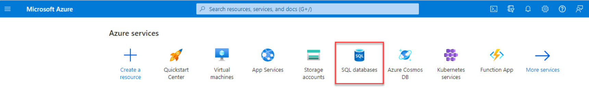
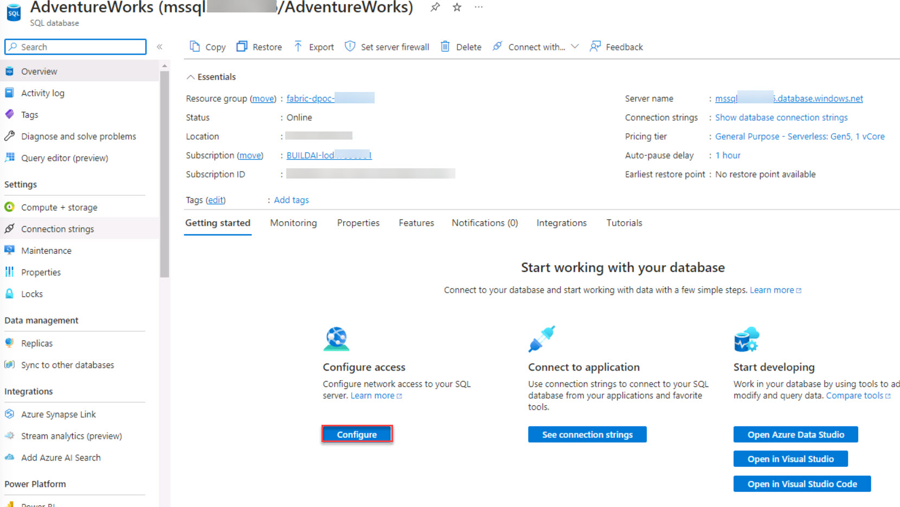
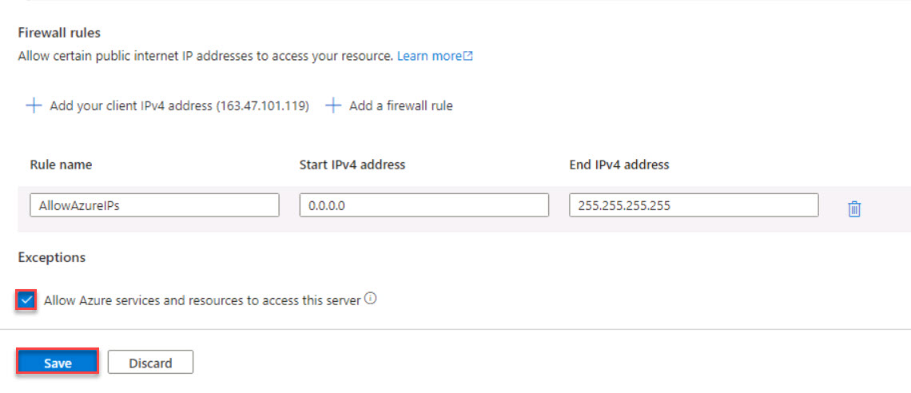

# Task 0.1: Deploy an Azure SQL Database and sample data

In this task, you will provision an Azure SQL database. The database will contain the raw data that will be ingested into the data lake.

>{: .important }
>If you want to learn more about Azure SQL Database, go to [**What is Azure SQL Database?**](https://learn.microsoft.com/azure/azure-sql/database/sql-database-paas-overview?view=azuresql "What is Azure SQL Database?").

1. Open a browser and go to **https://portal.azure.com/**. Sign in by using your credentials. 

    | Setting | Value |
    |:---------|:---------|
    | Username   | **Your Azure Username**   |
    | Password   | **Your Azure Password**   |

1. On the Azure Home page, in the list of **Azure services**, select **SQL databases**.

    

    >{: .note }
    >If you do not see SQL databases in the list of displayed resources, use the Search field to search for and select **SQL databases**.

1. On the menu for the SQL databases page, select **+ Create**.

1. In the Resource group field, select **@lab.CloudResourceGroup(ResourceGroup1).Name**. 

1. In the Database name field, enter **Adventureworks**.

1. In the Server field, select **Create new**.

1. On the Create SQL Database Server page, in the Server name field, enter **mssql@lab.LabInstance.Id**.  

1. In the Authentication section, select **Use SQL authentication**.

1. Enter the following credentials:

    | Setting | Value |
    |:---------|:---------|
    | Server admin login   | **labsqladmin**   |
    | Password   | **Smoothie@2023**   | 
    | Confirm password   | **Smoothie@2023**   |

1. On the Create SQL Database Server page, select **OK**.

1. On the Create SQL Database page, configure the remaining database settings by using the values in the following table. Leave all other settings at their default values.

    | Tab | Setting | Value        |
    |:---------|:---------|:------------------------------|
    | Basics   |Want to use SQL elastic pool? | **No**    |
    | Basics   |Workload environment  | **Development**   |   
    | Basics   |Backup storage redundancy   | **Locally-redundant backup storage**   |
    | Networking | Network connectivity| **Public endpoint**|
    | Networking |Firewall rules > Add current client IP address   | **Yes**   |
    | Additional settings | Data source > Use existing data   | **Sample**   |

    >{: .note }
    >In the use existing data field, when you select **Sample** you will be asked to confirm that you want the AdventureworksLT sample data added. Select **OK**.

1. Select **Review & Create**. After the validation step completes, select **Create**.

    >{: .note }
    > It may take 2-5 minutes for the deployment process to complete.

1. After the deployment is complete, select **Go to resource**.

1. On the SQL database - Overview page, scroll down to the  **Configure access** section and select **Configure**.

    

1. In the left navigation pane, in the Security section, select **Networking**.

1. On the SQL database - Networking page, scroll down to the Firewall rules section, select **Allow Azure services and resources to access this server**, and then select **Save**.

     
