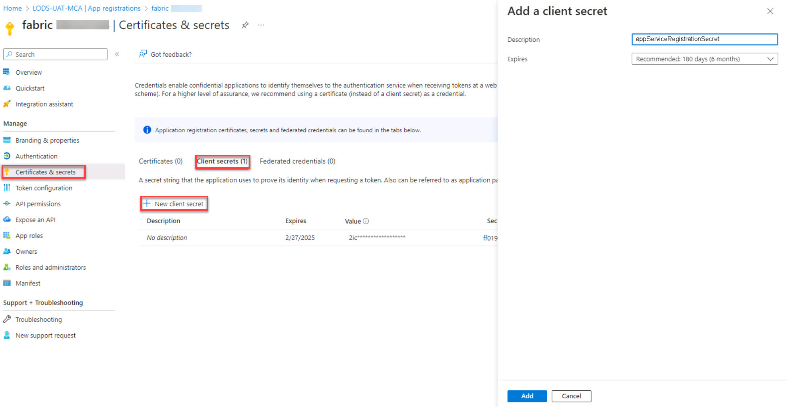

# Task 01: Configure a service account and secret

Configuring a service principal and secret for accessing a Databricks workspace ensures secure authentication and authorization for programmatic interactions. The service principal and secret separate sensitive credentials, allow fine-grained control over permissions, and enable applications to securely access Databricks resources while adhering to the principal of least privilege. 

In this task, you’ll create a service account and secret for an existing app registration. 

>{: .important } If you want to learn more about creating a service principal, go to [**Register a Microsoft Entra app and create a service principal**](https://learn.microsoft.com/en-us/entra/identity-platform/howto-create-service-principal-portal "Register a Microsoft Entra app and create a service principal"). 

1. Open a browser and go to [**https://portal.azure.com/**](https://portal.azure.com/). Sign in by using the following credentials.

    | Setting | Value |
    |:---------|:---------|
    | Username   | **Your Azure Username**   |
    | Password   | **Your Azure Password**   |

1. On the Azure Home page, in the search box, search for and select **Microsoft Entra ID**. 

 

1. On the **Microsoft Entra ID Overview** page, in the left menu, select **Manage** and then select **App registrations**. 

 

1. On the menu, select **+ New registration**. 

 

1. On the **Register an Application** page, enter **fabric@lab.LabInstance.Id** for the name. 

 

1. Select **Register**. 

 

1. On the **Overview** page, locate the **Essentials** section at the top of the page. Paste the values for the following settings into the appropriate text boxes: 

 

    | Default | Value | 
    |:---------|:---------| 
    | Display name   | **The name of your service account (e.g., MyServiceAccount)**   | 
    | Application (client) ID  | **The unique identifier for your app (e.g., [Your Application (client) ID])**   | 
    | Directory (tenant) ID  | **The unique identifier for your directory (e.g., [Your Directory (tenant) ID])**   | 

 

    >{: .warning } Be sure to move your mouse cursor outside of the text box after pasting text into any text boxes in the instructions. This ensures that the lab environment will save the values for use later in the lab.  

    >{: .note } You may find it helpful to copy these values into Notepad as well. At times, a page refresh will reset the entered value and require re-entering the values. 

1. In the left menu pane, select **Manage** and then select **Certificates & secrets**. 

 

1. Select the **Client secrets** tab and then select **+ New client secret**. 

 

1. In the Add a client secret window, select the **Description** box, enter **serviceAccountSecret**, and then select **Add**. 

 

     

 

1. On the **Certificates & secrets** page for the application, locate the secret that you just created. Copy the following values for **Description** and **Value** and paste these values into the appropriate text boxes: 

 

    >{: .warning } After you save the client secret, the value of the client secret is displayed. After you navigate away from the **Certificates & secrets** page, the value of the secret will no longer be available. Save the value in Notepad or elsewhere. 

 
   | Default | Value | 
   |:---------|:---------| 
   | Description | **@lab.TextBox(secretDescription)**   | 
   | Value | **@lab.TextBox(secretValue)**   | 
