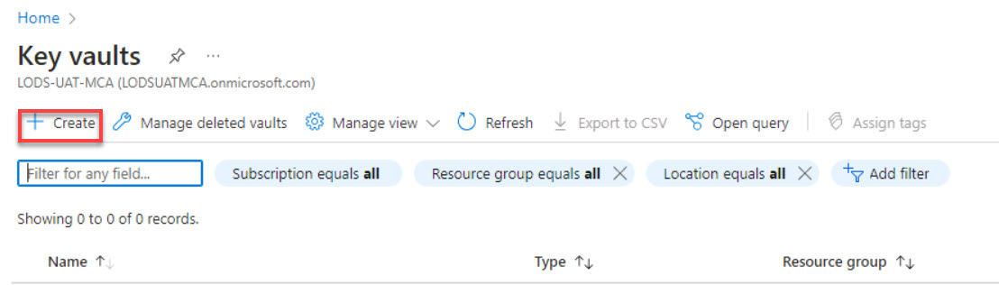
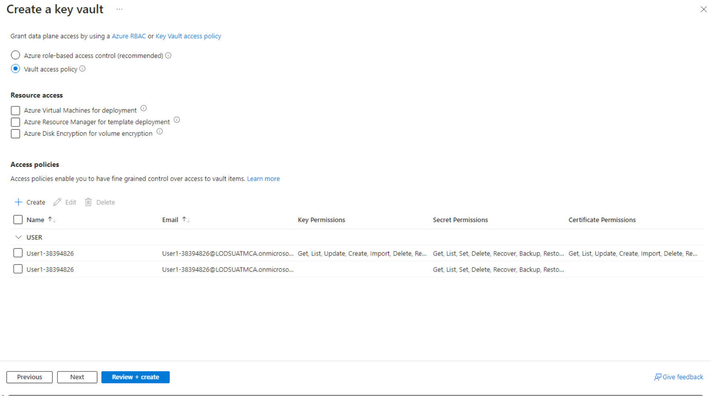
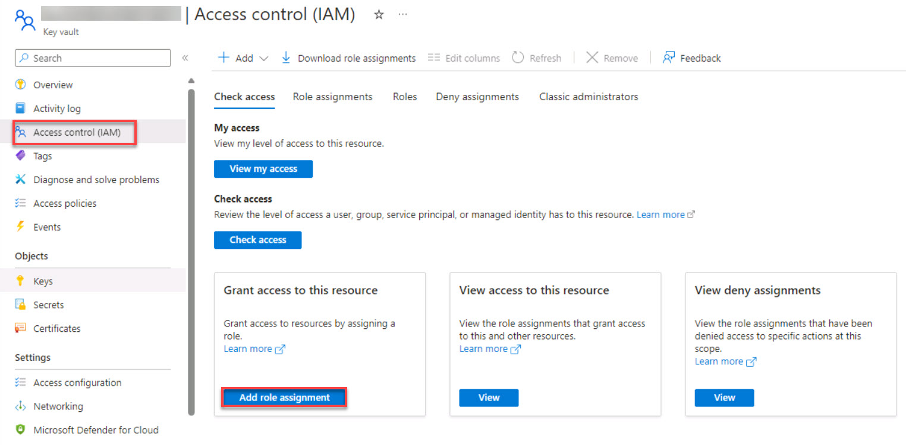

# Task 03: Create an Azure Key Vault instance

Task 3: Create an Azure Key Vault instance

Azure Key Vault is used to securely store and manage sensitive information such as passwords, encryption keys, and certificates. Key Vault provides a centralized and highly secure storage solution, safeguarding these critical assets from unauthorized access. 

By using Azure Key Vault, organizations can enhance security practices by reducing the risk of exposing sensitive data within applications or configuration files. Key Vault integrates seamlessly with other Azure services, enabling easy access to stored secrets while enforcing robust access control policies and auditing capabilities for compliance purposes.

In this task, you’ll provision an Azure Key Vault instance.

>{: .important }
>If you want to learn more about Azure Key Vault, go to [**Azure Key Vault basic concepts**](https://learn.microsoft.com/en-us/azure/key-vault/general/basic-concepts "Azure Key Vault basic concepts").

1. Return to the Azure Home page.

1. On the Azure Home page, in the search box, search for and select **Key vaults**.

1. On the menu for the **Key vaults** page, select **Create**.

    

1. On the **Basics** tab, enter the following values and then select **Next**:

    | Default | Value |
    |:---------|:---------|
    | Resource group   | **fabric-dpoc-@lab.LabInstance.Id**   |
    | Key vault name   | **[Choose a unique name for your Key Vault]**   |
    | Region   | Keep the default   |
    | Pricing tier   | **Standard**   |

1. On the **Access configuration** tab, in the **Permission model** section, select **Vault access policy**. 

1. In the **Access policies** section, select **+ Create**.

1. On the **Permissions** tab, in the **Configure from a template** dropdown list, select **Secret Management**. Review the permissions that the Secret Management template provides.

1. Select **Next**.

    

1. On the **Principal** tab, search for and select the user or service principal that you want to assign permissions to, and then select **Next**.

1. On the **Application (optional)** tab, search for and select **azuredatabricks** and then select **Next**.

1. Select **Create**.

1. On the **Create a key vault** page, select **Review + create**.

    

1. Select **Create** to complete the access policy and return to the **Create a key vault** page.

1. Select **Review & Create**. After the validation step completes, select **Create**.
 
1. After the deployment is complete, select **Go to resource**.

1. In the left navigation, select **Objects** and then select **Secrets**.

1. On the menu for the ** Key vault Secrets** page, select **+ Generate/Import**.

    

1. Configure the secret by using the following values:

    | Default | Value |
    |:---------|:---------|
    | Name   |  **[Your Secret Name]** (e.g., appServiceRegistrationSecret) |
    | Secret value   |  **[Your Secret Value]**   |

    >{: .important }
    >To access resources in your subscription, you must assign a role to the application. The process includes granting permissions by using Azure Key Vault. This ensures secure storage and retrieval of client secrets for authentication and authorization purposes.

1. Select **Create**.

1. In the left navigation pane for the **Key vault secrets** page, select **Access control (IAM)**. In the **Grant access to this resource** tile, select **Add role assignment**.

    

1. In the search box, enter and select **Key Vault Contributor**, and then select **Next**.

1. On the **Members** tab, in the **Members** section, select **+ Select members**.

1. In the Select members window, enter and select the appropriate member (e.g., [Your Service Account Name]) from the list and then select **Select**.

1. Select **Review + assign** twice.
