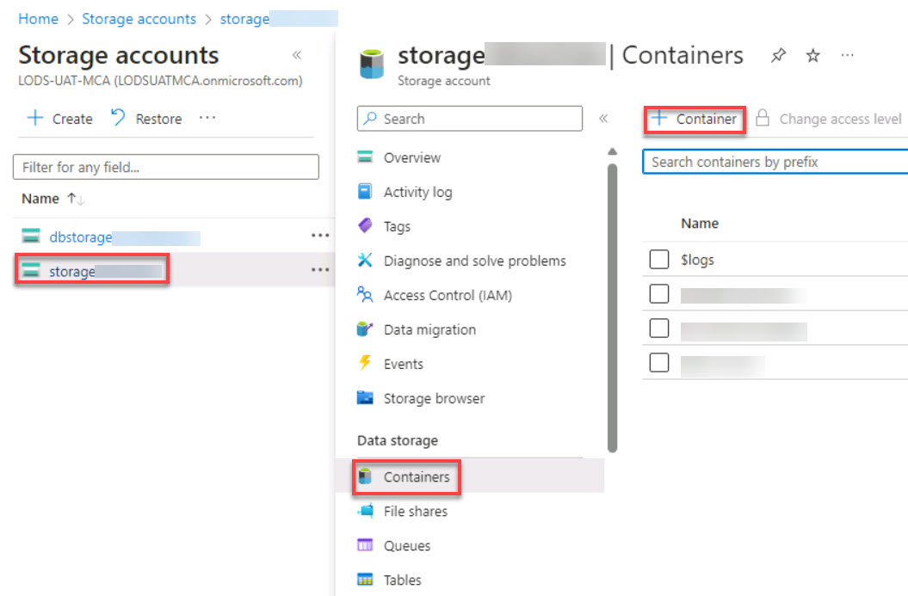
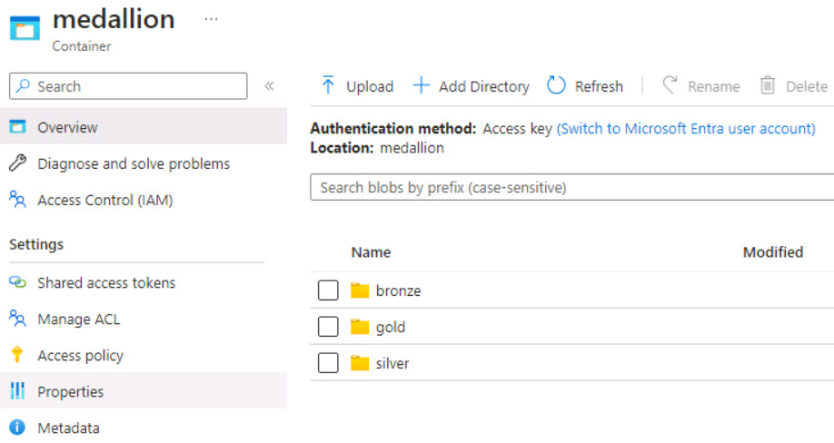

# Task 0.4: Add a Lakehouse container to the Storage account.

As part of the pre-deployment steps for this lab environment, a storage account named storage@lab.LabInstance.Id. The account will serve as an Azure Data Lake Storage Gen2 (ADLS Gen2) storage account to provide a scalable, secure, and cost-effective storage for big data analytics workloads. 

Azure Data Lake Storage Gen2 (ADLS Gen2) storage accounts combine the capabilities of Azure Blob Storage with the hierarchical namespace feature of Azure Data Lake Storage Gen1 to offer enhanced performance, security, and analytics capabilities.

In this task, you will add a role assignment to the storage account. You will then add a container named medallion and subfolders to contain the bronze, silver, and gold medallion data.

>{: .highlight }
>If you want to learn more about Azure SQL Database, go to [**Introduction to Azure Data Lake Storage Gen2**](https://learn.microsoft.com/en-us/azure/storage/blobs/data-lake-storage-introduction "Introduction to Azure Data Lake Storage Gen2").

1. On the Azure search box, enter and select **Storage accounts**.

1. Select the **storage@lab.LabInstance.Id** Storage account.

1. In the left navigation pane, select **Access Control (IAM)**.

1. In the left navigation pane for teh Key vault secrets page, select **Access control (IAM)**. In the Grant access to this resource tile, select **Add role assignment**.

1. In the Search field, search for **Storage Blob Data Contributor**.

1. Select **Storage Blob Data Contributor** from the search results and then select **Next**.

1. On the Members tab, in the Members section, select **+ Select members**.

    >{: .note }
    >We will add two members.

1. In the Select members search box, enter **@lab.CloudPortalCredential(User1).Username** and then select the user from the search results. Select **Select**.

1. On the Add role assignment page, select **+ Select members** to add the second member.

1. In the Select members search box, enter **@lab.Variable(serviceAccountName)** nd then select the member from the search results. Select **Select**.

1. On the Add role assginment page, select **Review + assign** twice.

1. On the Access Control (IAM) page for the storage account, in the left navigation pane, select **Data storage** and then select **Containers**.

1. On the menu for the Storage account Containers page, select **+ Container**.

    

1. In the New container window, in the name box, enter **medallion**.

1. Set the value for the Anonymous access level to **Container (anonymous read access for containers and blobs)** and then select **Create**.

    >{: .note }
    >You may see a warning display alerting you that all container and blob data can be read by anonymous request. You can safely ignore this warning.

1.  On the Storage account Containers page select the **medallion** container. 

1. On the menu, use **+ Add Directory** to create the following subdirectories in the medallion container:

    | Default | Value |
    |:---------|:---------|
    | New Directory 1   |  **bronze**   |
    | New Directory 2   |  **silver**   |
    | New Directory 3   |  **gold**     |

    
