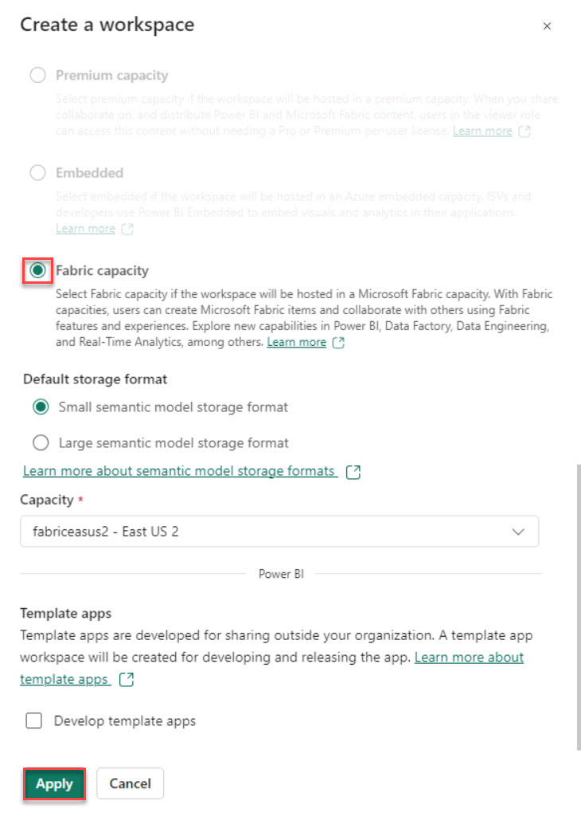
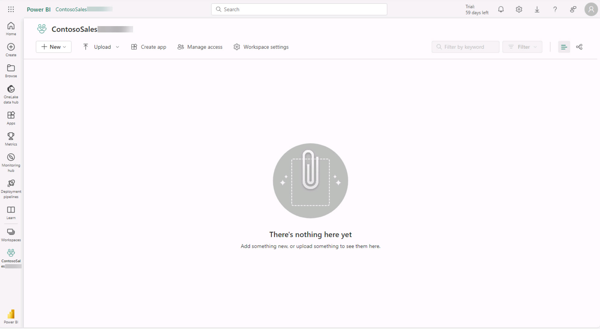

# Task 1.1: Deploy SQL database

1. Open a new browser tab and go to **https://app.powerbi.com/**

    >{: .note }
    >You may see a message alerting you that you have been assigned a Microsoft Fabric (Free) license. Select **OK** to dismiss the message.

1. On the Power BI Home page, in the left navigation pane, select **Workspaces** and then select **+ New workspace**.

1. In the Name field, enter  **ContosoSales@lab.LabInstance.Id** After Azure verifies that the name is available, select **Advanced**.

1. In the License mode section, verify that **Fabric capacity** is selected and then select **Apply**.

    

1. On the Power BI ContosoSales@lab.LabInstance.Id page, select **Workspaces** and verify that the ContosoSales@lab.LabInstance.Id workspace was created. 

    

    >{: .note }
    >If the ContosoSales@lab.LabInstance.Id  was not created, repeat the steps in this task to create the workspace.

1. Select the ContosoSales@lab.LabInstance.Id workspace. 
