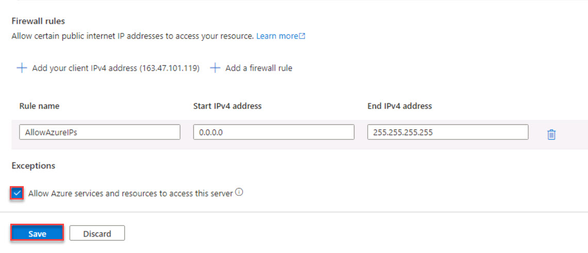

# Task 1.1: Deploy SQL database

The Azure SQL database contains the source of the raw data that will be ingested into the data lake.

Use the following resources to learn more about creating an Azure SQL database.  

[What is Azure SQL Database?](https://learn.microsoft.com/azure/azure-sql/database/sql-database-paas-overview?view=azuresql)

[Quickstart: Create a single database - Azure SQL Database](https://learn.microsoft.com/azure/azure-sql/database/single-database-create-quickstart?view=azuresql&tabs=azure-portal)

1. Sign into @lab.VirtualMachine(Base VM).SelectLink with the following credentials:

    | Default | Value |
    |:---------|:---------|
    | Username   | +++@lab.VirtualMachine(Base VM).Username+++   |
    | Password   | +++@lab.VirtualMachine(Base VM).Password+++   | 

1. Open a browser and go to +++**https://portal.azure.com/**+++ and sign in with the following credentials:

    | Default | Value |
    |:---------|:---------|
    | Username   | +++@lab.CloudPortalCredential(User1).Username+++   |
    | Password   | +++@lab.CloudPortalCredential(User1).Password+++   |

1. On the Azure Home page, under **Azure services**, select **SQL databases**.

    

1. On the **SQL databases** menu, select **+ Create**.

1. Create a SQL database by entering the following:

    | Default | Value |
    |:---------|:---------|
    | Database name   | +++AdventureWorks+++   |
    | Server   | **mssql@lab.LabInstance.Id (@lab.CloudResourceGroup(ResourceGroup1).Location)**   |
    | Want to use SQL elastic pool? | **No**    |
    | Workload environment  | **Development**   |   
    | Backup storage redundancy   | **Locally-redundant backup storage**   |
    | Firewall rules > Add current client IP address   | **Yes**   |
    | Data source > Use existing data   | **Sample**   |

1. Once the deployment is complete, select **go to resource**.

1. On the SQL database Overview page, under **Configure access**, select **Configure**.

    

1. In the left navigation area, under **Security**, select **Networking**.

1. Under **Firewall rules**, select the **Allow Azure services and resources to access this server** option and then select **Save**.

     
