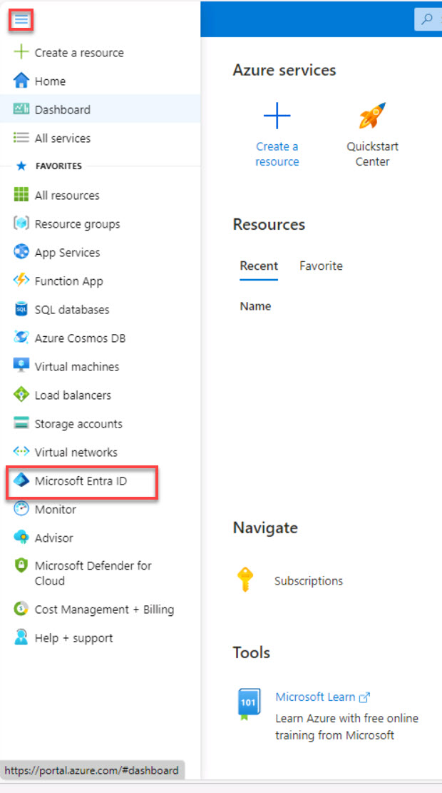
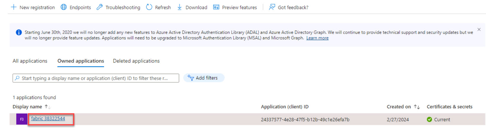
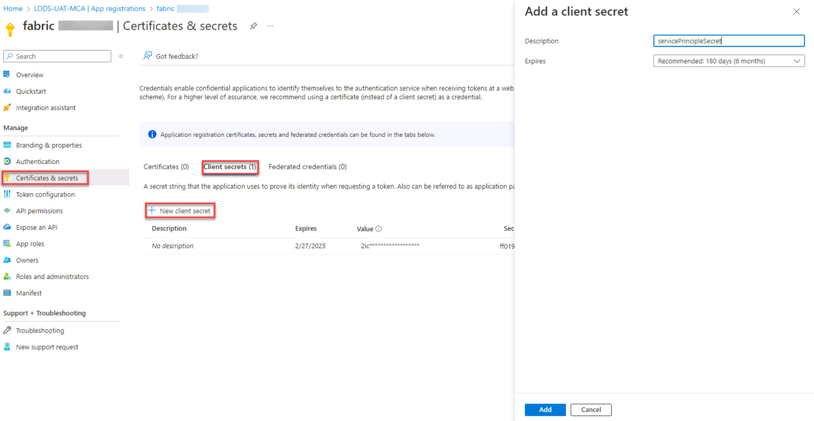

# Task 1.2: Configure a service account and secret
Configuring a service principal and secret for accessing a Databricks workspace ensures secure authentication and authorization for programmatic interactions. 

It separates sensitive credentials, allows fine-grained control over permissions, and enables applications to securely access Databricks resources while adhering to the principal of least privilege.

1. Return to the Azure Home page.

1. On the Azure Home page, on the portal menu, select **Microsoft Entra ID**.

    

1. On the Microsoft Entra ID Overview page, on the left navigation, under **Manage**, select **App registrations**.

1. Select the listed application.

    

1. On the Overview page, in the **Essentials** section, enter the following values:

    | Default | Value |
    |:---------|:---------|
    | Display name   | @lab.TextBox(serviceAccountName)   |
    | Application (client) ID  | @lab.TextBox(serviceApplicationID_clientID)   |
    | Directory (tenant) ID  | @lab.TextBox(serviceDirectoryID_tenantID)   |

    >[!alert] Copy these values into Notepad as well. At times, a page refresh will reset the entered value and require re-entering the values.
    

1. On the left navigation, under **Manage**, select **Certificates & secrets**.

1. Select the **Client secrets** tab and then select **+ New client secret**.

1. In the Add a client secret window, in the **Description** box, enter +++serviceAccountSecret+++ and then select **Add**.

    

1. Enter the secret **Description** and secret **Value**:

    >[!alert] **Once you navigate away from this page, access to these values won’t be available and you’ll be required to create a new secret.**

    | Default | Value |
    |:---------|:---------|
    | Description   | @lab.TextBox(secretDescription)   |
    | Value   | @lab.TextBox(secretValue)   |

    >[!knowledge] **Once you've saved the client secret, the value of the client secret is displayed. This is only displayed once, so copy this value and store it. Right-click the browser tab and duplicate it to continue to the next step without venturing away from this page.**
