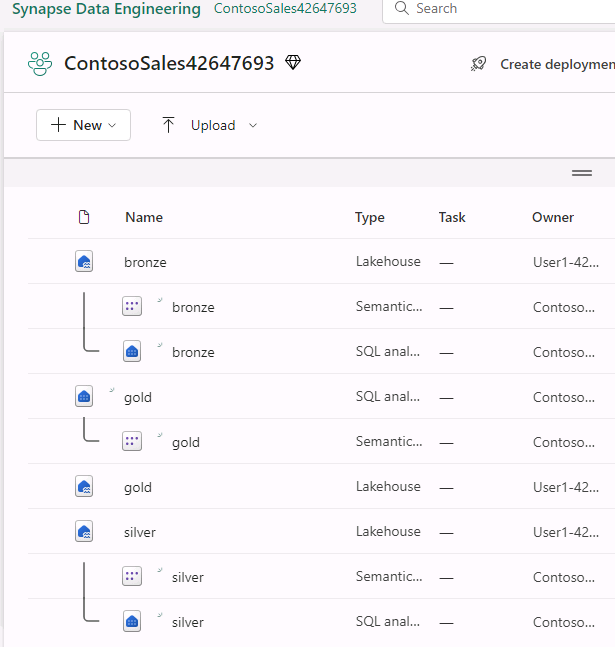

# Task 02: Create Lakehouses

Now, let's see how each department in Contoso can easily create a Lakehouse in their workspace without any provisioning by simply providing the name, given the proper access rights, of course!

1. In the left menu pane for the page, select **ContosoSales@lab.LabInstance.Id**. On the **ContosoSales@lab.LabInstance.Id** page, select **+ New item**. 

1. Scroll down to the **Store data** section of the New item dialog and select **Lakehouse**.

1. In the **Name** field for the New lakhouse dialog, enter +++**bronze**+++ and then select **Create**. 

    !MAGE[bronzelakehouse.jpg](../media/instructions254096/bronzelakehouse.jpg)

1. Repeat steps 1-3 to create two more Lakehouses. Use the following names for the new Lakehouses:

    | Lakehouse Name |
    |:---------|
    | **silver** |
    |**gold** |  

1. In the left navigation pane for the Synapse Data Engineering Home page, select the name of your workspace. You should see the three Lakehouses and related objects listed.
   
    

{: .important }
> Now you are ready to start data ingestion. You will first ingest the raw data in the bronze layer. After that, you will curate and enrich the data as you move the data to the silver and then gold layer.