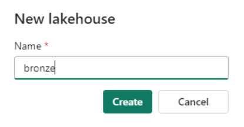

# Task 1.2: Create Lakehouses

Now, let's see how each department in Contoso can easily create a Lakehouse in their workspace without any provisioning by simply providing the name, given the proper access rights, of course!

1.	In the lower left of the navigation pane for the workspace, select **Power BI**. Then, in the Synapse section, select **Data Engineering**. 

    

    >{: .note }
    >Selecting Data Enginering switches the context from reports and visualizations to data engineering.   You should see that the options presented in the left navigation pane change to reflect the change in context.

1.	On the Synapse Data Engineering Home page, select the **Lakehouse** tile.

    <!-- !IMAGE[Lakehouse.jpg](instructions254907/Lakehouse.jpg) 

    <!-- >[!alert]Creating the Lakehouse will automatically upgrade the workspace to a free Microsoft Fabric trial. Review the message and then select **OK** to continue.

    !IMAGE[upgradetrial.jpg](instructions254096/upgradetrial.jpg) -->

1. In the Name field, enter +++**bronze**+++ and then select **Create**. The context switches to the bronze page.

    

1. In the lower left of the navigation pane for the bronze page, select **Data Engineering**. Then, in the Synapse section, select **Data Engineering** to return to the Synapse Data Engineering Home page. 

   >{: .note }
   >This step switches the context from the bronze lakehouse back to the workspace.

1. Repeat steps 2-4 to create two more lakehouses. Use the following names for the new lakehouses:

    | Lakehouse Name |
    |:---------|
    - **silver**
    - **gold**   

1. In the left navigation pane for the Synapse Data Engineering Home page, select **ContosoSales@lab.LabInstance.Id**. You should see the three lakehouses and related objects listed.

    

>{: .important }
>Now you are ready to start data ingestion. You will first ingest the raw data in the bronze layer. After that, you will curate and enrich the data as you move the data to the silver and then gold layer.

