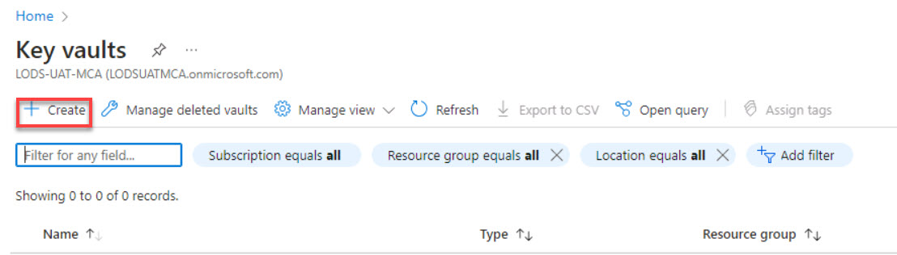
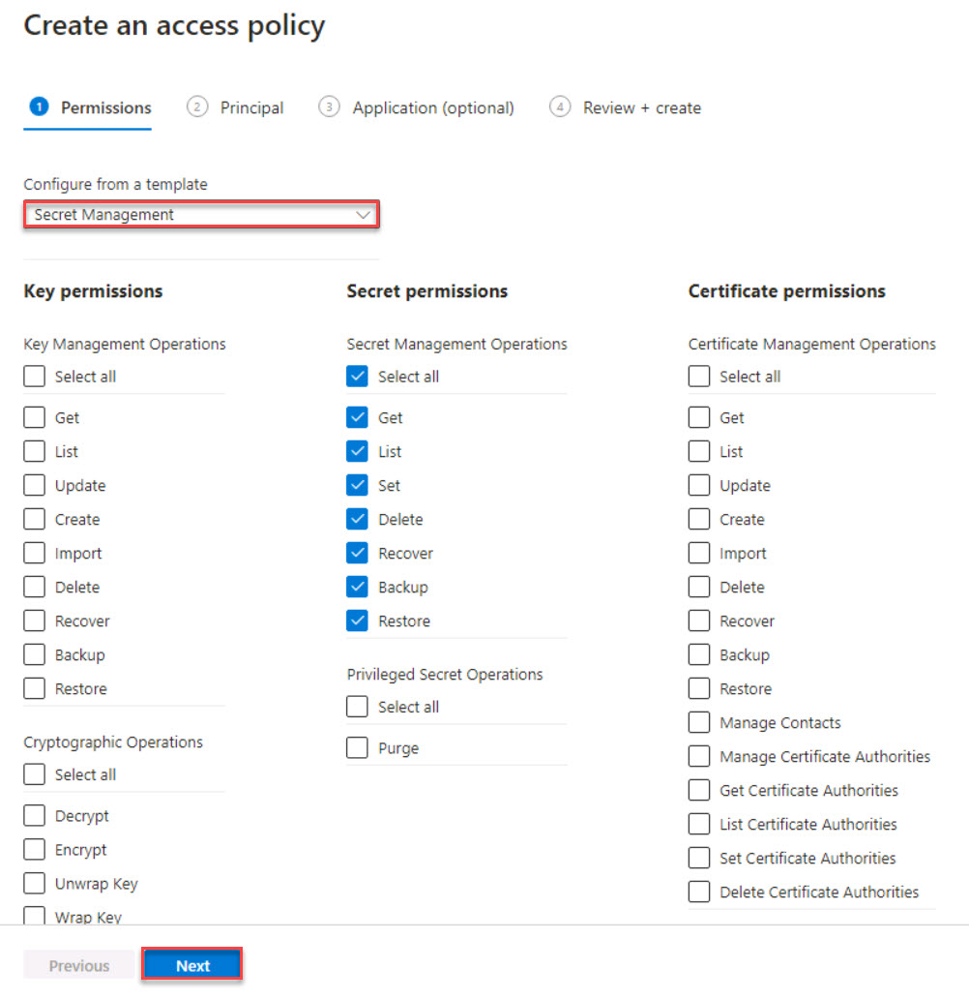
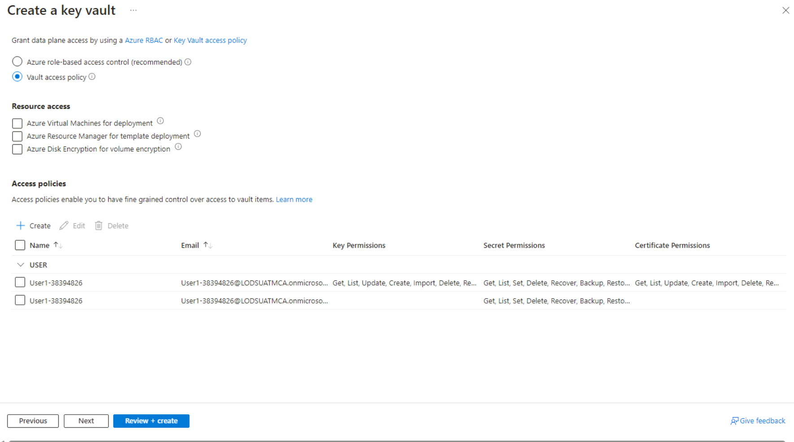
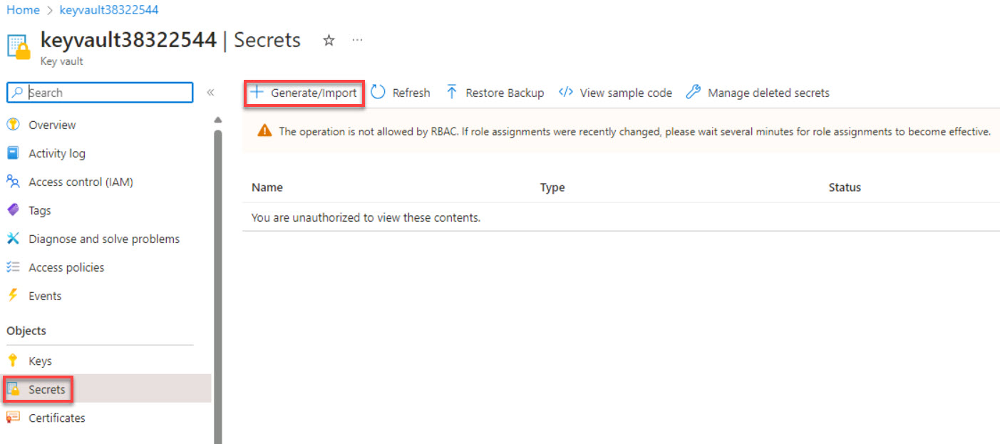
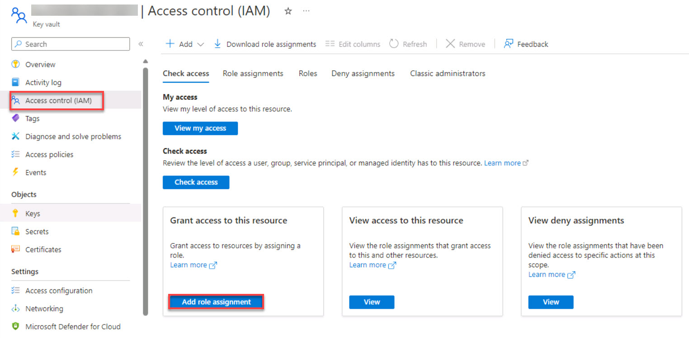

# Task 1.3: Create a Key Vault

Azure Key Vault is used to securely store and manage sensitive information such as passwords, encryption keys, and certificates. It provides a centralized and highly secure storage solution, safeguarding these critical assets from unauthorized access. 

By utilizing Azure Key Vault, organizations can enhance security practices by reducing the risk of exposing sensitive data within applications or configuration files. 

Additionally, Key Vault integrates seamlessly with other Azure services, enabling easy access to stored secrets while enforcing robust access control policies and auditing capabilities for compliance purposes.

1. On the Azure search box, enter +++Key vaults+++ and then under **Services**, select **Key Vaults**.

1. On the **Key Vaults** menu, select **Create**.

    

1. Create a new key vault. On the **Basics** tab, enter the following:

    | Default | Value |
    |:---------|:---------|
    | Resource group   | **fabric-dpoc-@lab.LabInstance.Id**   |
    | Key vault name   | +++keyvault@lab.LabInstance.Id+++   |
    | Region   | **Choose your region**   |
    | Pricing tier   | **Standard**   |

1. On the **Access configuration** tab, under **Permission model**, select the **Vault access policy** option. 

1. Under **Access policies**, select **+Create**.

1. From the **Configure from a template** dropdown menu, select **Secret Management**.

1. Select **Next**.

    

1. On the **Principal** tab, in the search box, enter +++@lab.CloudPortalCredential(User1).Username+++, then select it from the list and select **Next**.

1. On the **Application (optional)** tab, enter +++azuredatabricks+++, then select it from the list and select **Next**.

1. Select **Create**.

1. On the Create a key vault page, select **Review + create**.

    

1. Select **Create**.
 
1. Once the deployment is complete, select **Go to resource**.

1. On the left navigation, under **Objects**, select **Secrets**.

1. On the Key Vault Secrets menu, select **+ Generate/Import**.

    

1. Create a secret with the following values:

    | Default | Value |
    |:---------|:---------|
    | Name   |  +++keyvaultSecret+++   |
    | Secret value   |  +++@lab.Variable(secretValue)+++   |

## Add the client secret

 {: .important }
 > To access resources in your subscription, you must assign a role to the application, which includes granting permissions via Azure Key Vault, to ensure secure storage and retrieval of client secrets for authentication and authorization purposes.

1. On the left navigation, select **Access control (IAM)** and then in the **Grant access to this resource** tile, select **Add role assignment**.

    

1. In the search box, enter +++Key Vault Contributor+++, select it from the list and then select **Next**.

1. On the **Members** tab, next to **Members**, select **+ Select members**.

1. On the Select members window, enter and select +++@lab.Variable(serviceAccountName)+++ from the list and then select **Select**.

1. Select **Review + assign** twice.
