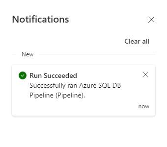

# Task 03: Using data pipelines/data flow for data ingestion

There are multiple ways to ingest data into a Lakehouse, and in this exercise, Contoso focuses on using data pipelines and data flow to efficiently funnel diverse datasets into their system, setting the stage for advanced analytics and insights. 

1. On the **ContosoSales@lab.LabInstance.Id** page, select **+ New item**. 

1. Scroll to the **Get data** section of the New item dialog and select **Data pipeline**.

1. In the dialog that displays, enter **Azure SQL DB Pipeline** for the pipeline name and then select **Create**.

1. Select the **Copy data assistant** tile.

    
    
    <!--  -->

1. On the **Choose data source** page, select **Azure SQL Database**. You may need to scroll down to see the **Azure SQL Database** option.

    

1. Configure the connection by using the values in the following table. Leave all other settings at their default values.

    {: .warning }
    > If there’s no value listed for the **Server** setting, right-click the instructions pane in the lab environment and  select **Refresh**.

    | Default | Value |
    |:---------|:---------|
    | Server   | **sql@lab.LabInstance.Id.database.windows.net**   |
    | Database   | **DB01**   |
    | Authentication kind   | **Basic**   |
    | Username   | **azureadmin1**   |
    | Password   | **@lab.CloudPortalCredential(User1).Password**  |
    
    

1. Select **Next**. Close any pop-up windows that display and wait for the connection to be created.

1. On the **Connect to data source** page, select **Tables**.

    {: .note }
    > It may take 30-60 seconds to display the list of tables.

1. Select **Select all**, clear the **dbo.BuildVersion** and **dbo.ErrorLog** checkboxes, and then select **Next**.

    

1. On the **Choose data destinations** page, search for and select +++Azure Data Lake Storage Gen2+++.

    

1. On the **Connect to data destination** page, enter the following to create a new connection: 
    
    | Default | Value |
    |:---------|:---------|
    | URL   | **https://sa@lab.LabInstance.Id.dfs.core.windows.net/**   |
    | Authentication kind   | **Organizational account**   |
    

    <!-- | Tenant ID   | +++**@lab.Variable(serviceDirectoryID_tenantID)**+++   |
    | Service principal client ID   | +++**@lab.Variable(serviceApplicationID_clientID)**+++   |
    | Service principal Key   | +++**@lab.Variable(secretDescription)**+++   | -->

    {: .important }
    > The connection URL for the Data Lake Storage account can be located here: Storage account > Settings > Endpoints > Data Lake Storage.

       

1. Select the account that’s already authenticated and then select **Next**.

1. On the **Connect to data destination** page, next to the **Folder path** box, select **Browse**.

1. Select **medallion** > **bronze** and then select **OK**.

1. In the **File name suffix** box, enter **.csv** and then select **Next** to test the connection.

    

1. Select **Next** and then select **Save + Run**. After a brief delay, the Pipeline Run window displays.

    

1. In the Pipeline Run window, select **OK**. The pipeline will start processing.

1. On the upper right of the page, select **Notifications**. You can use the Notifications area to monitor the pipeline.

    

1. At the lower left of the page, above **Data Factory**, select the ellipses (**...**) icon and then select **Monitor**. 
    
1. Verify that the value in the **Status** box for the pipeline is **Succeeded**.

    {: .warning }
    > Please wait for the pipeline to execute. If the notification continues to say it’s running after 10 minutes, check the monitoring hub for a succeeded status.
    >
    >

1. After the status shows **Succeeded**, your data has been transferred from Azure SQL Database to ADLS Gen 2.

    