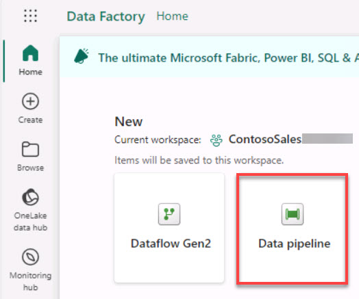

# Task 1.3: Using data pipelines/data flow for data ingestion

There are multiple ways to ingest data into a Lakehouse, and in this exercise, Contoso focuses on using data pipelines and data flow to efficiently funnel diverse datasets into their system, setting the stage for advanced analytics and insights. 

1. In the lower left of the navigation pane for the workspace, select **Data Engineering** and then select **Data Factory**.

    

1. Select the **Data pipeline** tile.

    

1. Enter **Azure SQL DB Pipeline** for the pipeline name and then select **Create**.

1. Select the **Copy data assistant** tile.

    
    
    <!-- !IMAGE[copyData.jpg](instructions254096/copyData.jpg) -->

1. On the Choose data source page, select **Azure SQL Database**. You may need to scroll down to see the Azure SQL Database option.

    

1. Configure the connection by using the values in the following table. Leave all other settings at their default values.

    >{: .warning }
    >If there is no value listed for the Server setting, right-click the instructions pane in the lab environment and  select **Refresh**.

    | Default | Value |
    |:---------|:---------|
    | Server   | **@lab.Variable(sqlEndpoint)**   |
    | Database   | **Adventureworks**   |
    | Authentication kind   | **Basic**   |
    | Username   | **labsqladmin**   |
    | Password   | **Smoothie@2023**   |
    
    

1. Select **Next**. Close any pop-up windows that display and wait for the connection to be created.

1. On the Connect to data source dialog, in the Select a table seciiont, select **Tables**.

1. Select **Select all**. Clear the **dbo.BuildVersion** and **dbo.ErrorLog** checkboxes and select **Next**.

    

1. On the Choose data destinations page, search for and select +++Azure Data Lake Storage Gen2+++.

    

1. On the Connect to data destination page, enter the following to create a new connection: 
    
    | Default | Value |
    |:---------|:---------|
    | URL   | **https://storage@lab.LabInstance.Id.dfs.core.windows.net/**   |
    | Authentication kind   | **Organizational account**   |
    

    <!-- | Tenant ID   | +++**@lab.Variable(serviceDirectoryID_tenantID)**+++   |
    | Service principal client ID   | +++**@lab.Variable(serviceApplicationID_clientID)**+++   |
    | Service principal Key   | +++**@lab.Variable(secretDescription)**+++   | -->

    >{: .important }
    >The connection URL for the Data Lake Storage account can be located here: Storage account > Settings > Endpoints > Data Lake Storage.
    >
       

1. Select **Sign in**.

1. Select the account that’s already authenticated and then select **Next**.

1. On the Connect to data destination page, next to the **Folder path** box, select **Browse**.

1. Select **medallion** > **bronze** and then select **OK**.

1. In the **File name suffix** box, enter **.csv** and then select **Next** to test the connection.

    

1. Select **Next** and then Select **Save + Run**. After a brief delay, the Pipeline Run window displays.

    

1. In the **Pipeline run** window, select **OK**. The pipeline will start processing.

1. On the upper-right of the page, select **Notifications**. You can use the Notifications area to monitor the pipeline.

    

1. At the bottom left of the page, select **Data Factory**. The, in the Synapse section, select **Data Engineering**.

1. In the left navigation pane for the Synapse Data Engineering Home page, select **Monitor**.

    >{: .note }
    >You may need to select the ellipses (**...**) icon display the Monitor option.  The name for this page is in flux. You may see Monitor or you may see Monitoring Hub.
    
1. Verify that the value in the Status field for the pipeline is Succeeded.

    >{: .warning }
    >Please wait for the pipeline to execute. If the notification continues to say it’s running after 10 minutes, check the monitoring hub for a succeeded status.
    >

1. After the status shows **Succeeded**, your data has been transferred from Azure SQL Database to ADLS Gen 2.

    

    >{: important }
    >Similarly, you can get data into the Lakehouses using pipelines from various other sources like Snowflake, Dataverse, and so on.
