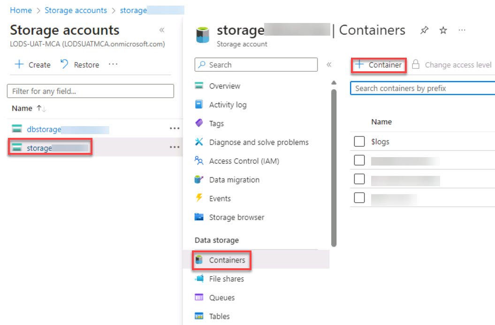
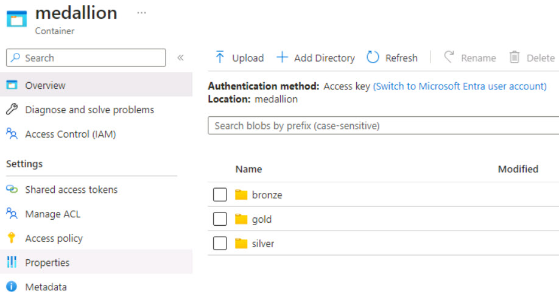

# Task 1.4: Add a Lakehouse container to the Storage account.

The container will serve as an Azure Data Lake Storage Gen2 (ADLS Gen2) storage account to provide a scalable, secure, and cost-effective solution for storing big data analytics workloads. 

It combines the capabilities of Azure Blob Storage with the hierarchical namespace feature of Azure Data Lake Storage Gen1, offering enhanced performance, security, and analytics capabilities.

1. On the Azure search box, enter and select +++storage accounts+++.

1. Select the **storage@lab.LabInstance.Id** Storage account.

1. On the left navigation, select **Access Control (IAM)**.

1. On the **Grant access to this resource** tile, select **Add role assignment**.

1. In the search box, enter +++Storage Blob Data Contributor+++.

1. Select **Storage Blob Data Contributor** from the list and then select **Next**.

1. On the **Members** tab, next to **Members**, select **+ Select members**.

1. In the Select members search box, enter and select +++@lab.CloudPortalCredential(User1).Username+++ and select
**Select**.

1. Add the service principal user, next to **Members**, select **+ Select members**.
 
    {: .note }
    > We will add two members.
 
1. In the Select members search box, enter and select +++@lab.CloudPortalCredential(User1).Username+++ and select **Select**.
 
1. Select **+ Select members** to add the second member.
 
1. In the Select members search box, enter and select +++@lab.Variable(serviceAccountName)+++ and select **Select**.
 
1. Select **Review + assign** twice.

1. On the left pane, under **Data storage**, select **Containers**.

1. On the menu, select **+ Container**.

    

1. In the New container window, in the name box, enter +++medallion+++.

1. Set **Anonymous access level** to **Container (anonymous read access for containers and blobs)** and then select **Create**.

1. Select the **medallion** container. 

1. On the menu, select **+ Add Directory**.

1. Create three directories using the following directory names:

    | Default | Value |
    |:---------|:---------|
    | New Directory 1   |  +++bronze+++   |
    | New Directory 2   |  +++silver+++   |
    | New Directory 3   |  +++gold+++     |

    
