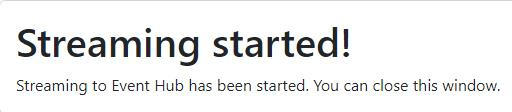

# Exercise 1: Data Engineering experience, Including Data ingestion from a spectrum of analytical data sources into OneLake

*Before we start executing the steps, we will trigger the simulator app to start streaming data to EventHub.*

1. Open a **Microsoft Edge** browser from VM desktop.

2. Select the browser URL field and select **https://app-realtime-kpi-analytics-@lab.LabInstance.Id.azurewebsites.net** to browse app service.

	{: .note }
	> **Do not select anywhere else on the screen until all of the text has been auto filled.**

4. You will see a page like the one shown below. You can proceed with next steps while it loads.

