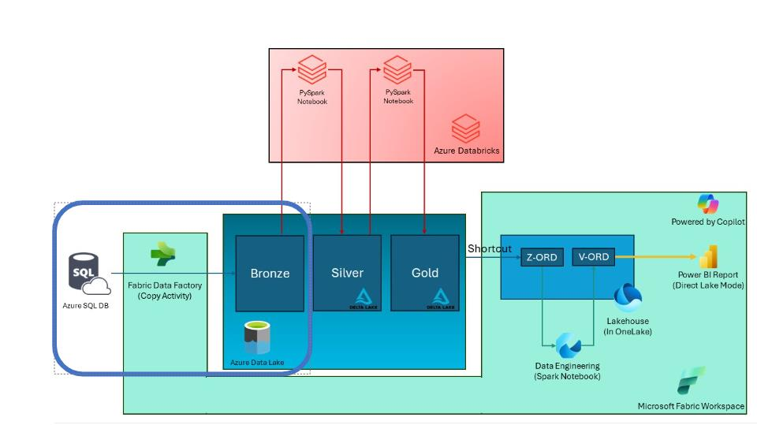
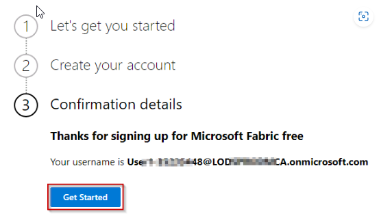
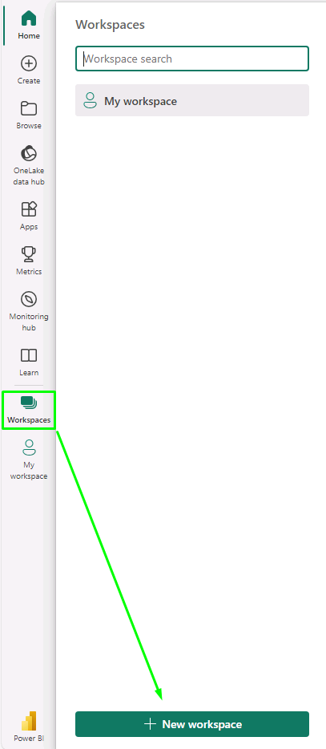

# Task 2.1: Create a Microsoft Fabric-enabled workspace

Contoso is setting up a Fabric-enabled workspace as the cornerstone for Contoso's data integration efforts, facilitating a seamless blend of disparate data sources. 

 

1. Open a new browser tab and go to +++**https://app.powerbi.com/**+++.

    {: .important }
    > This link will take you to the new Fabric site to set up an instance. Follow the wizard to set up the new Fabric resource.

1. On the You've selected Microsoft Fabric free page, select **Continue**.

    

1. In the **Business phone number** field, enter +++1230000849+++, and then select **Get Started**. 

    

1. At the bottom of the page, select **Get Started**.

    

    {: .warning }
    > **Wait for the PowerBI Workspace to load**

    

    {: .note }
    > Close the top bar for a better view.

    

1. On the Power BI Home page, on the left navigation, select **Workspaces** and then select **+ New workspace**.

    

1. Enter +++**ContosoSales@lab.LabInstance.Id**+++ as the workspace name, verify that the name is available, and expand the **Advanced** section.

1. Scroll down and verify that the **Fabric capacity** option is selected and then select **Apply**.

    

1. Select **Workspaces** to verify if the workspace with the given name was created. If not, perform the steps above again to create the workspace.

    
