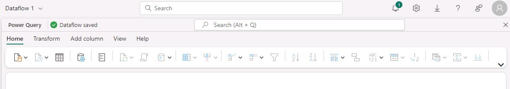
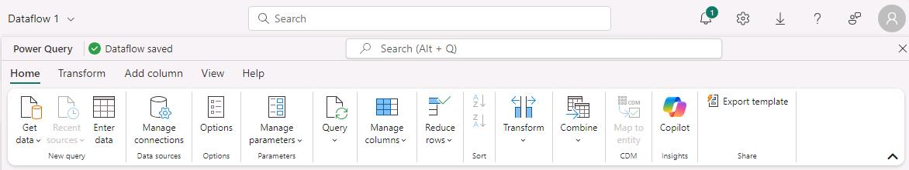
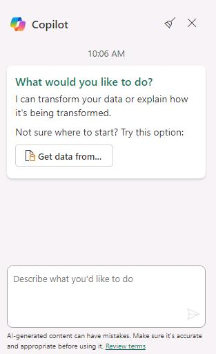

# Task 01: Explore Copilot for data flows

1. Open a new browser tab and go to [https://app.powerbi.com/](https://app.powerbi.com/).   

1. On the **Power BI** Home page, in the left menu pane, select **Workspaces** and then select **+ New workspace**.

1. In the **Name** box, enter  **CopilotDataFlowDemo@lab.LabInstance.Id**. After Azure verifies that the name is available, select **Advanced**.

1. In the **License mode** section, verify that **Fabric capacity** is selected and then select **Apply**.

1. On the **ContosoDataFlowDemo@lab.LabInstance.Id** page, select **+ New item**. 

1. Scroll to the **Store data** section of the New item dialog and select **Lakehouse**.

1. In the **Name** field for the New lakehouse dialog, enter +++CopilotDataFlow@lab.LabInstance.Id+++ and then select **Create**. 

1. In the left menu pane for the page, select **CopilotDataFlow@lab.LabInstance.Id** and then select **+ New item**.

1. Scroll to the Prepare data section and select **Dataflow Gen2** and then select **Create**. The collapsed Power Query ribbon displays.

    

1. Select the down arrow (**&or;**) that appears at the right end of the ribbon to expand the ribbon.

    

1. On the **Home** tab of the Power Query ribbon, select **Copilot**. The **Copilot** pane displays on the right side of the page.

    

1. In the **Copilot** pane, select **Get data from**. 

1. On the **Choose data source** page, select **Azure SQL database**.

    {: .note }
    > For this task, you’ll connect to the same database that you connected to in the previous exercise.

1. Configure the connection by using the values in the following table. Leave all other settings at their default values.

    {: .warning }
    > If there’s no value listed for the **Server** setting, right-click the instructions pane in the lab environment and  select **Refresh**.

    | Default | Value |
    |:---------|:---------|
    | Server   | **[Your SQL Server Name]**   |
    | Database   | ****Adventureworks****   |
    | Authentication kind   | **Basic**   |
    | Username   | **[Your SQL Admin Username]**   |
    | Password   | **[Your SQL Admin Password]**   |

1. Select **Next** to test the connection. If the connection is successful, the **Choose data** page displays.

1. Select the following eight tables from the list of tables and then select **Create**.

    - SalesLT.Address
    - SalesLT.Customer
    - SalesLT.CustomerAddress
    - SalesLT.Product
    - SalesLT.ProductCategory
    - SalesLT.ProductModel
    - SalesLT.SalesOrderDetail
    - SalesLT.SalesOrderHeader

    

1. In the **Copilot** pane, enter **Only keep Canadian customers** in the **Describe what you'd like to do** box and then select **Submit**.

1. Verify that Copilot has added a step to the query. You should see the added filter in the **Query settings** pane. You should also see the response from Copilot in the **Copilot** pane.

    

    {: .warning }
    > Copilot for Fabric notebooks is in preview. During lab testing, we experienced mixed results when we submitted this prompt. In most cases, Coplilot successfully added a step to filter rows according to the query. Occasionally, Copilot was not able to perform the requested action.

1. If Copilot doesn’t add the query step, you can add the step manually. In the grid that previews the data, select the drop-down list next to the **CountryRegion** column. Clear the **Select All** checkbox and then select **Canada**. Select **OK** to implement the filter.   At the top of the Power Query window, you should see the formula displayed that filters the data.

    

1. In the **Copilot** pane, enter **Create a new query with data for official public holidays in Canada in 2024** in the **Describe what you'd like to do** box and then select **Submit**. A new query is added.

    

1. Select **Publish**. You’ll be returned to the **CopilotDataFlowDemo** workspace page.