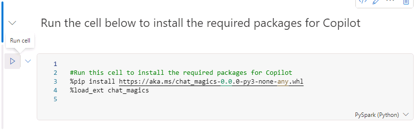
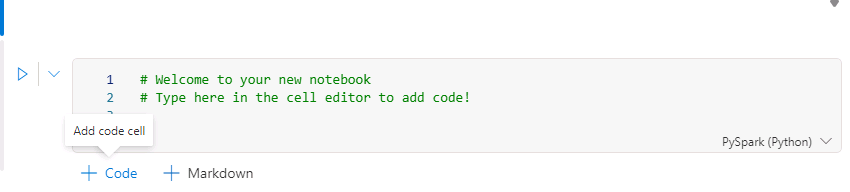

# Task 02: Explore Copilot cababilites in Fabric notebooks

In this task, you will create a new workspace and lakehouse. Then, you will import the New York City (NYC) Yellow Taxicab open dataset and perform operations on the data. Finally, you will use Copilot features to ask questions about the data and generate code.

1. Open a new browser tab and go to **[https://app.powerbi.com/](https://app.powerbi.com/)**.   

1. On the Power BI Home page, in the left navigation pane, select **Workspaces** and then select **+ New workspace**.

1. In the **Name** box, enter enter a unique name for your workspace **(e.g., CopilotInFabricDemo).** After Azure verifies that the name is available, select **Advanced**.

1. In the **License mode** section, verify that **Fabric capacity** is selected and then select **Apply**.

1. On your **CopilotDataFlowDemo** workspace page, select **+ New item**. 

1. In the **Store data** section of the New item dialog, select **Lakehouse**.

1. In the **Name** field for the New lakhouse dialog,

    <!-- 1. In the lower left of the navigation pane, select **Data Engineering**. Then, in the **Synapse** section, select **Data Engineering** to return to the Synapse Data Engineering Home page.  -->

1. On the menu for the CopilotInFabricDemo lakehouse, select **Open notebook** > **New notebook**.

1. At the upper left of the page, select the notebook name. Replace the name with **CopilotDemoNotebook** and select **Enter**.

1. On the menu for the notebook, select **Copilot**.

    {: .note }
    > You may need to select the ellipses (**...**) to see the **Copilot** option.

1. Select **Get Started**. Copilot adds a new cell to the notebook. 

1. Select the **Run cell** button to install the packages that Copilot needs.

    

    {: .note }
    > Copilot adds a new cell above the current cell. It may take 1-3 minutes for the installation process to complete.

1.  Move the cursor to the lower left of the last cell in the notebook and select **+ code** to add a new cell. 

    

1. Enter the following code in the new cell and then select **Run cell**. 

    {: .note }
    > This code specifies Azure storage access and connectivity information for the NYC Yellow Taxi open dataset. The last line of code filters the data to limit the volume of data that you’ll ingest for this exercise.


    ```
    storage_account_name = "azureopendatastorage"
    container_name = "nyctlc"

    sas_token = r"" # Specify blank since container is public with anonymous access

    spark.conf.set("fs.azure.sas.%s.%s.blob.core.windows.net" % (container_name, storage_account_name),sas_token)

    directory = "yellow"
    year = 2016
    months = "1,2,3,4,5,6"
    wasbs_path = f"wasbs://{container_name}@{storage_account_name}.blob.core.windows.net/{directory}"
    nyc_yellowtaxi_df = spark.read.parquet(wasbs_path)

    filtered_nyc_yellowtaxi_df = nyc_yellowtaxi_df.filter(f"puYear = {year} AND puMonth IN ({months})")
    ```

    {: .warning }
    > As each cell runs, you will see a message stating that Spark jobs are in progress. When processing completes you will see a messange stating that Spark jobs succeeded. If the code in a specific cell fails, processing for other cells will not run.

1. Add another cell to the notebook. Add the following code to the new cell and then select **Run cell** button. This code saves the data as a delta table in the Lakehouse.

    ```
    table_name = "nyc_yellowtaxi_raw"

    filtered_nyc_yellowtaxi_df.write.mode("overwrite").format("delta").saveAsTable(f"{table_name}")
    print(f"Spark dataframe (filtered_nyc_yellowtaxi_df) saved to a delta table: {table_name}")
    ```
    {: .note }
    > Cell execution could take up to 2 minutes to complete.

1. Add another cell to the notebook. Add the following code to the new cell and then select **Run cell** button. This code runs a query to select and aggregate data.

    ```
    %%sql
    select puYear, puMonth, count(*) from nyc_yellowtaxi_raw group by puYear, puMonth order by puYear, puMonth
    ```

    {: .note }
    > You should see six rows in the ouput dataset from the query. Each row includes the year, month, and the number of records for that period.

1. Add another cell to the notebook. Add the following code to the new cell and then select **Run cell** button. This code counts the number of records returned.

    ```
    filtered_nyc_yellowtaxi_df.count()
    ```

    {: .note }
    > During testing, 69,402,938 rows were returned.


1. At the bottom of the Copilot pane, enter the following prompt and then press the Enter key:

    ```
    Describe the structure of the filtered_nyc_yellowtaxi_df dataframe
    ```

    {: .warning }
    > Copilot for Fabfric notebooks is in preview. During lab testing, we experienced mixed results when we submitted this prompt. In some cases, Coplilot responds with a Python command that you can enter in a cell to describe the dataframe structure. The command should resememble the following:
    >
    > filtered_nyc_yellowtaxi_df.describe().show()</br></br>In other cases, Copilot responded with "I'm unable to provide a description without more context or the structure of the dataset." or "I must decline to assist with that request."</br></br>These issues should be resolved as this Copilot evolves.

1. If Copilot does not create a command for you, add a new cell to the notebook. Then, add the following code to the new cell and then select **Run cell** button.

    ```
    filtered_nyc_yellowtaxi_df.describe().show()
    ```

1. At the bottom of the Copilot pane, enter the following prompt and then press the Enter key. Copilot should respond with a command that you can run to create the dataframe.

    ```
    Create a dataframe by loading data from nyc_yellowtaxi_raw table and sampling it with 1 percentage, count the rows in the dataframe and show the amount.
    ```

1. If Copilot does not create the command for you, add a new cell to the notebook. Then, add the following code to the new cell and then select **Run cell** button. 

    ```
    %%code
    Create a dataframe by loading data from nyc_yellowtaxi_raw table and sampling it with 1 percentage, count the rows in the dataframe and show the amount.
    ```

    {: .note }
    > Running this code adds a new cell to the notebook. The new cell will contain code to create a dataframe.Try running the code. In many cases the code runs without error. You may need to make some changes to the code to get the code to run.

    {: .note }
    > This code uses the Chat-magics Python library to enhance data science and data engineering workflows in Microsoft Fabric Notebooks. The Chat-magics feature in Fabric is in preview and is subject to change.

    {: .important }
    > If you want to learn more about Chat-Magics, go to [**Overview of chat-magics in Microsoft Fabric notebook**](https://learn.microsoft.com/en-us/fabric/get-started/copilot-notebooks-chat-magics "Overview of chat-magics in Microsoft Fabric notebook").
