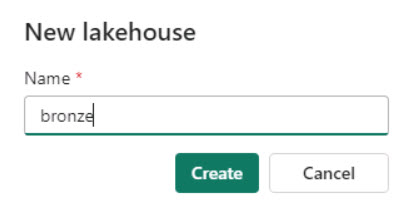

# Task 2.2: Create Lakehouses

Now, let's see how each department in Contoso could easily create a Lakehouse in their workspace without any provisioning needed by simply providing the name, given the proper access rights, of course!

1.	Once in the workspace, on the lower left navigation, select **Power BI**.

1.	Under **Synapse**, select **Data Engineering**.

    

1.	On the Synapse Data Engineering Home page, select the **Lakehouse** tile.

    <!--  

    <!-- >[!alert]Creating the Lakehouse will automatically upgrade the workspace to a free Microsoft Fabric trial. Review the message and then select **OK** to continue.

     -->

1. In the **Name** field, enter +++**bronze**+++ and then select **Create**.

    

1. From the **bronze** home page, in the lower left, select **Data Engineering** and then under **Synapse**, select **Data Engineering** to return to the Synapse Data Engineering Home page. 

1. Repeat the Lakehouse creation process to create two more Lakehouses with the following names:

    | Lakehouse Name |
    |:---------|
    | - [] +++**silver**+++   |
    | - [] +++**gold**+++   |
    
    {: .important }
   > For this lab we need three Lakehouses: bronze, silver, and gold.

1. On the left navigation, select **ContosoSales@lab.LabInstance.Id**.

    {: .important }
    > We’re now ready to start data ingestion. We’ll first ingest the raw data in the bronze layer from disparate sources for Contoso. After that, the data will be curated and enriched to the silver and then gold layers.

1. Select **Workspaces** to verify if the workspace with the given name was created. If not, perform the steps above again to create the workspace.

    
