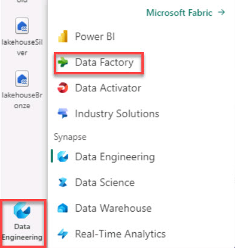
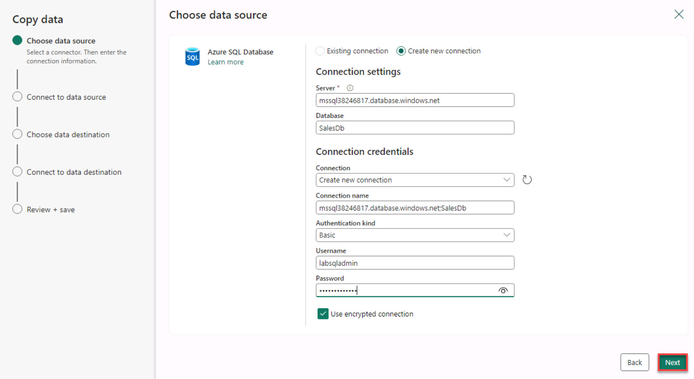
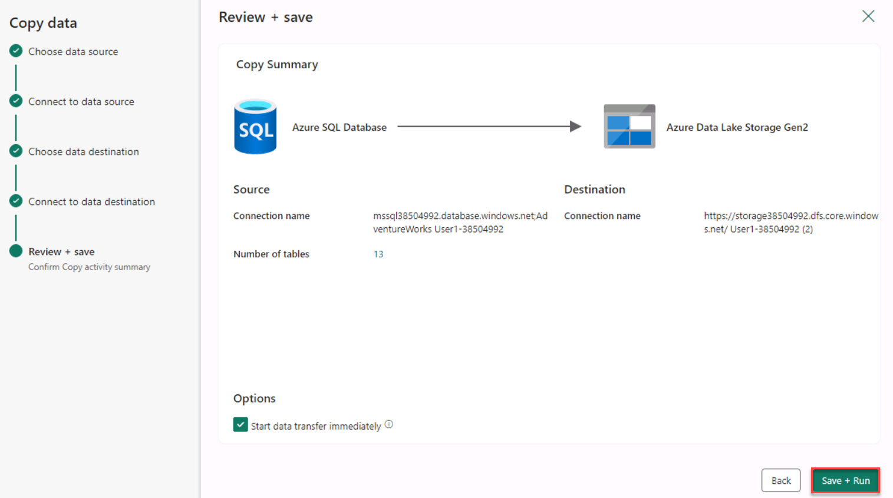
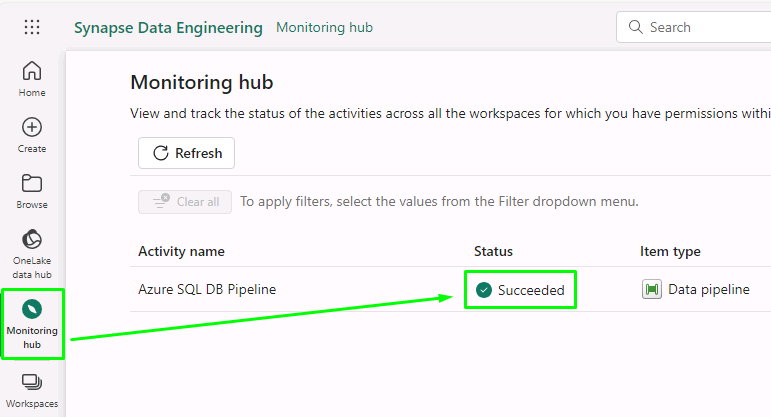
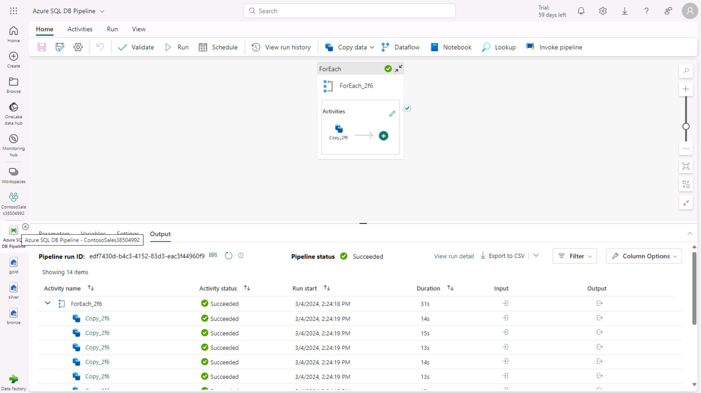

# Task 2.3: Using data pipelines/data flow for data ingestion

There are multiple ways to ingest data into a Lakehouse, and in this exercise, Contoso focuses on using data pipelines and data flow to efficiently funnel diverse datasets into their system, setting the stage for advanced analytics and insights. 

1. In the lower left, select **Data Engineering** and then select **Data Factory**.

    

1. Select the **Data pipeline** tile.

    

1. Enter +++**Azure SQL DB Pipeline**+++ for the pipeline name and then select **Create**.

1. Select the **Copy data** tile.

    

1. On the Choose data source page, scroll down to select **Azure SQL Database** and then select **Next**.

    

1. Select the **Create new connection** option and then use the information below to populate the fields and then select **Next**.

    {: .warning }
    > If the server value is blank, right-click inside the instructions panel to refresh.

    | Default | Value |
    |:---------|:---------|
    | Server   | +++**@lab.Variable(sqlEndpoint)**+++   |
    | Database   | +++**Adventureworks**+++   |
    | Authentication kind   | **Basic**   |
    | Username   | +++**labsqladmin**+++   |
    | Password   | +++**Smoothie@2023**+++   |
    | Use encrypted connection   | **Selected**   | 

    

    {: .note }
    > Close any pop-up window that you see and wait for the connection to be created.

1. Under **Select a table**, select the **Tables** option.

1. Select the **Select all** option, then clear the **dbo.BuildVersion** and **dbo.ErrorLog** options and select **Next**.

    

1. On the Choose data destinations page, select the **Azure Data Lake Storage Gen2** tile and then select **Next**.

    

1. Select the **Create new connection** option and then enter the following to create a new connection: 
    
    | Default | Value |
    |:---------|:---------|
    | URL   | +++**https://storage@lab.LabInstance.Id.dfs.core.windows.net/**+++   |
    | Authentication kind   | **Organizational account**   |
    

    <!-- | Tenant ID   | +++**@lab.Variable(serviceDirectoryID_tenantID)**+++   |
    | Service principal client ID   | +++**@lab.Variable(serviceApplicationID_clientID)**+++   |
    | Service principal Key   | +++**@lab.Variable(secretDescription)**+++   | -->

    {: .important }
    > The connection URL for the Data Lake Storage account can be located here: Storage account > Settings > Endpoints > Data Lake Storage.
    >    

1. Select **Sign in** and sign in with the account that’s already authenticated.       

1. Select **Next**.

1. On the Connect to data destination page, next to the **Folder path** box, select **Browse**.

1. Under Root folder, select **medallion** > **Bronze** and then select **OK**.

1. In the **File name suffix** box, enter +++**.csv**+++ and then select **Next** to test the connection.

    

1. Keep the defaults and select **Next**.

1. Select **Save + Run**.

    

1. On the **Pipeline run** window, select **OK**.

1. On the upper-right of the page, select **Notifications**.

    

1. Verify the **Running status** of the pipeline.

    {: .warning }
    > Please wait for the pipeline to execute. If the notification continues to say it’s running after 10 minutes, check the monitoring hub for a succeeded status.
    > 

1. Once the status shows **Succeeded**, your data has been transferred from Azure SQL Database to ADLS Gen 2.

    

    {: .important }
    > Similarly, you can get data into the Lakehouses using pipelines from various other sources like Snowflake, Dataverse, and so on.
