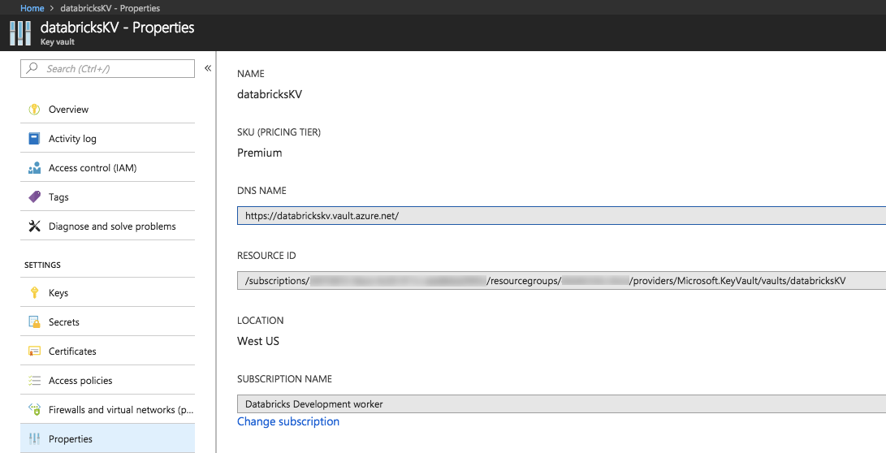
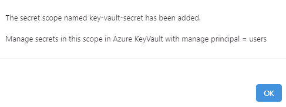

# Task 3.1: Create Azure Key Vault-backed secret scope for workspace

To reference the client secret stored in an Azure Key Vault, you can create a secret scope backed by Azure Key Vault in Azure Databricks.

1. Open a new browser tab and go to +++**https://@lab.Variable(workspaceurl)#secrets/createScope**+++.

    {: .important }
    > This URL is case sensitive; scope in createScope must be uppercase.

1. Select **Sign in with Azure AD**.    

1. On the Create Secret Scope page, enter the following to create a secret scope:

    | Default | Value |
    |:---------|:---------|
    | Scope Name   | +++scopesecret+++   |
    | Managing Principal   | **All Users**   |
    |      | **Azure Key Vault settings**   |
    | DNS Name   | +++https://keyvault@lab.LabInstance.Id.vault.azure.net/+++   |
    | Resource ID   | +++/subscriptions/@lab.CloudSubscription.Id/resourcegroups/fabric-dpoc-@lab.LabInstance.Id/providers/Microsoft.KeyVault/vaults/keyvault@lab.LabInstance.Id+++   |

    

    {: .important }
    > These properties are available from the **Properties** tab of an Azure Key Vault in your Azure portal.
    > 

1. Select **Create**.

1. Select **OK**.

    
