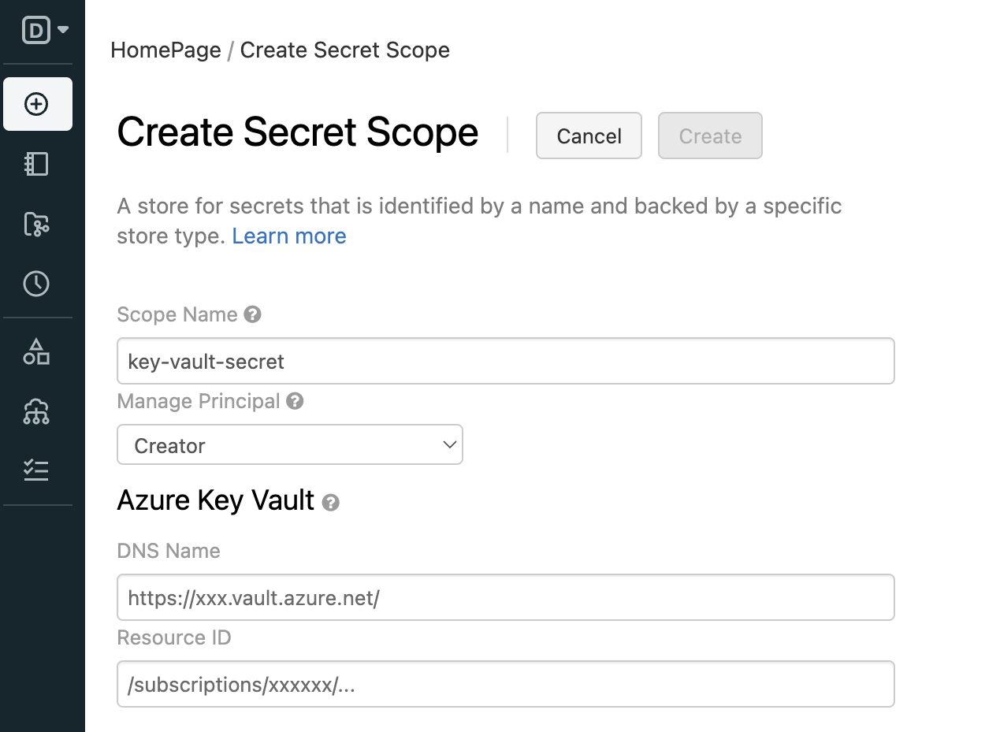

# Task 3.1: Create Azure Key Vault-backed secret scope for workspace

To reference the client secret stored in an Azure Key Vault, you can create a secret scope backed by Azure Key Vault in Azure Databricks.

1. Open a new browser tab and go to your Azure Databricks workspace URL with the following path: **https://<your-databricks-workspace-url>#secrets/createScope**.

1. Select **Sign in with Microsoft Entra ID**.    

1. On the Create Secret Scope page, enter the following informatoin and then select **Create**.

    | Default | Value |
    |:---------|:---------|
    | Scope Name   | **scopesecret**   |
    | Managing Principal   | **All workspace Users**   |
    |      | **Azure Key Vault settings**   |
    | DNS Name   | **[Your Azure Key Vault DNS Name, e.g., https://your-keyvault-name.vault.azure.net/]**   |
    | Resource ID   | **[Your Azure Key Vault Resource ID]**   |

    

    {: .important }
    > These properties are available from the **Properties** tab of an Azure Key Vault in your Azure portal.
    > 

1. Select **OK**.

    
