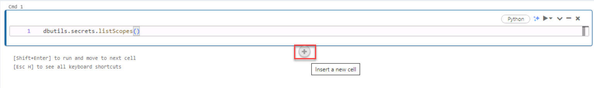
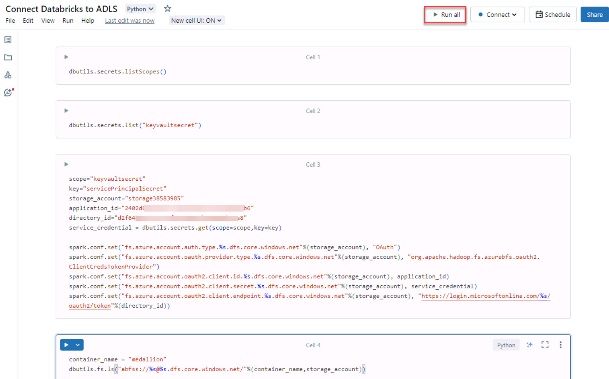
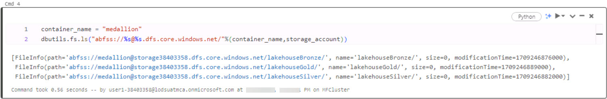

# Task 3.2: Connect to Azure Data Lake Storage

Explore an analytics pipeline using open Delta format and Azure Databricks Delta Live Tables. Stitch data (landed earlier) to create a combined data product to build a simple Lakehouse and integrate with OneLake.

Contoso already had some of their compute workload on **Azure Databricks**. You don’t need to migrate any of that workload to work with Fabric. You can simply use the OneLake endpoint to mount the storage and work with the same data directly from the Lakehouse for the analytical and ML operations.

1. On the left navigation, select **Workspace**.

1. Add a notebook to the workspace.

    

1. Rename the notebook by selecting the title box and clearing the current name, then enter +++Connect Databricks to ADLS+++. 

1. Select the **Cmd 1** cell.

1. List the available Secret Scopes by entering the following:
    
    ```
    dbutils.secrets.listScopes()
    ```

1. Insert a new cell.

    

1. Select the **Cmd 2** cell.

1. List the active Scopes by entering the following:

    ```
    dbutils.secrets.list("scopesecret")
    ```

1. Insert a new cell and select it.

1. Connect the Databricks Workspace to Storage Account via service principal by entering the following:

    ```
    scope="scopesecret"
    key="keyvaultSecret"
    storage_account="storage@lab.LabInstance.Id"
    application_id="@lab.Variable(serviceApplicationID_clientID)"
    directory_id="@lab.Variable(serviceDirectoryID_tenantID)"
    service_credential = dbutils.secrets.get(scope=scope,key=key)
 
    spark.conf.set("fs.azure.account.auth.type.%s.dfs.core.windows.net"%(storage_account), "OAuth")
    spark.conf.set("fs.azure.account.oauth.provider.type.%s.dfs.core.windows.net"%(storage_account), "org.apache.hadoop.fs.azurebfs.oauth2.ClientCredsTokenProvider")
    spark.conf.set("fs.azure.account.oauth2.client.id.%s.dfs.core.windows.net"%(storage_account), application_id)
    spark.conf.set("fs.azure.account.oauth2.client.secret.%s.dfs.core.windows.net"%(storage_account), service_credential)
    spark.conf.set("fs.azure.account.oauth2.client.endpoint.%s.dfs.core.windows.net"%(storage_account), "https://login.microsoftonline.com/%s/oauth2/token"%(directory_id))
    ```

1. Insert a new cell and select it.

1. Verify the connection to the Storage account by entering the following:

    ```
    container_name = "medallion"
    dbutils.fs.ls("abfss://%s@%s.dfs.core.windows.net/"%(container_name,storage_account))
    ```

1. In the upper-right corner, select **Run all**.

    

1. On the Attach to an existing compute resource window, select **Start, attach and run**.

    

    {: .warning }
    > It will take a few minutes for the execution to complete. 
    
    {: .note }
    > You can check the last cell of notebook for the last execution time to verify.
    > 
