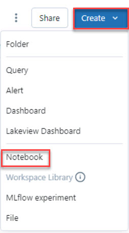

# Task 3.2: Connect to Azure Data Lake Storage

Explore an analytics pipeline using open Delta format and Azure Databricks Delta Live Tables. Stitch data (landed earlier) to create a combined data product to build a simple Lakehouse and integrate with OneLake.

Contoso already had some of their compute workload on **Azure Databricks**. You don’t need to migrate any of that workload to work with Fabric. You can simply use the OneLake endpoint to mount the storage and work with the same data directly from the Lakehouse for the analytical and ML operations.

1. On the left navigation, select **Workspace**.

1. In the Workspace > Users pane, select **Create** and then select **Notebook**. 

    

1. Select the title box at the top left of the notebook. Clear the existing title and enter **Connect Databricks to ADLS**. Press the Enter key to accept the change. 

1. In the first code cell, enter the following code. This code lists the available secret scopes:
    
    ```
    dbutils.secrets.listScopes()
    ```

1. Move the mouse cursor to the bottom left of the first code cell and then select **+ Code** to insert a new cell.

    

1. In the second code cell, enter the following code. This code lists the active scopes:

    ```
    dbutils.secrets.list("scopesecret")
    ```

1. Add another cell to the notebook. Add the following code to the new cell. This code connects the Databricks workspace to the storage account by using a service principal:

    ```
    scope="scopesecret"
    key="appServiceRegistrationSecret"
    storage_account="storage@lab.LabInstance.Id"
    application_id="@lab.Variable(serviceApplicationID_clientID)"
    directory_id="@lab.Variable(serviceDirectoryID_tenantID)"
    service_credential = dbutils.secrets.get(scope=scope,key=key)
 
    spark.conf.set("fs.azure.account.auth.type.%s.dfs.core.windows.net"%(storage_account), "OAuth")
    spark.conf.set("fs.azure.account.oauth.provider.type.%s.dfs.core.windows.net"%(storage_account), "org.apache.hadoop.fs.azurebfs.oauth2.ClientCredsTokenProvider")
    spark.conf.set("fs.azure.account.oauth2.client.id.%s.dfs.core.windows.net"%(storage_account), application_id)
    spark.conf.set("fs.azure.account.oauth2.client.secret.%s.dfs.core.windows.net"%(storage_account), service_credential)
    spark.conf.set("fs.azure.account.oauth2.client.endpoint.%s.dfs.core.windows.net"%(storage_account), "https://login.microsoftonline.com/%s/oauth2/token"%(directory_id))
    ```
 
  >{: .warning }
  >Remember that the Type Text feature streams content into the virtual machine. Wait until the entire command is entered into the cell before you move the mouse cursor.

1. Add another cell to the notebook. Add the following code to the new cell. This code verifies the connection to the storage account.

    ```
    container_name = "medallion"
    dbutils.fs.ls("abfss://%s@%s.dfs.core.windows.net/"%(container_name,storage_account))
    ```

1. In the upper-right corner, select **Run all**.

    

1. In the Attach to an existing compute resource window, select **Start, attach and run**.

    

    > {: .warning }
    > It will take 3-5 minutes for the processing to complete. 
    
    > {: .note }
    > You can check the last cell of notebook for the last execution time to verify.
    > 
