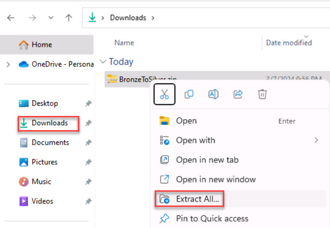
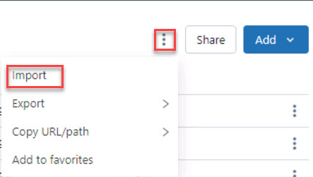
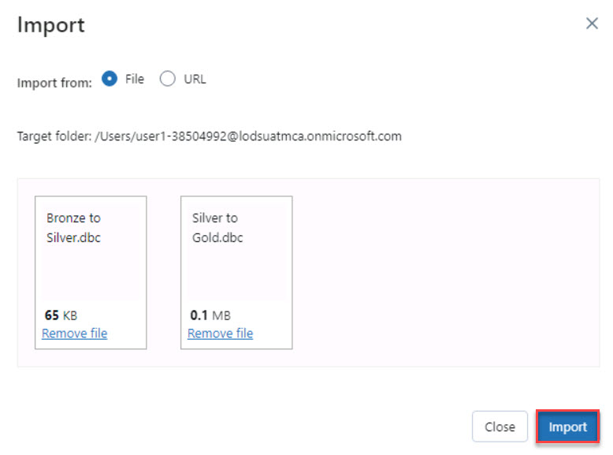

# Task 4.1: Read from Bronze layer, convert the data into delta format and write to the Silver layer

With this move we aim to clean and refine data within the Bronze layer, improving data quality and preparing it for further processing, aligning with Contoso's focus on reliable data foundations. 

{: .note }
> Data will be written as external tables. 

1. Open **File Explorer** and go to the **Downloads** folder.

1. Right-click the **BronzeToSilver.zip** and select **Extract All...**.

    

1. Select **Extract**, then close the **File Explorer** window.

1. Return to the **Databricks Workspace** browser tab.

1. On the left navigation, select **Workspace** to refresh the page.

1. From **Workspace** > **Users** > **@lab.CloudPortalCredential(User1).Username**, in the upper-right corner, select the vertical ellipse and then select **Import**.

    

1. On the Import window, select the **File** option and then select **browse**.

1. In **File Explorer**, go to +++C:\Downloads+++, then open the **BronzeToSilver** folder.

1. Select the **Bronze to Silver.dbc** and **Silver to Gold.dbc** files, then select **Open**.

    

1. Select **Import**.

1. Once the notebooks are imported, select the **Bronze to Silver** notebook.

    {: .important }
    > We’re now getting ready to transform and store processed data in the Silver layer in delta format, enhancing Contoso's data storage efficiency and accessibility for analytical processes.

1. In the **Cmd 1** cell, populate the **ENTERHERE** placeholders with the appropriate information.

    **Cmd 1**
   
    | Name | Value |
    |:---------|:---------|
    | scope   | +++scopesecret+++   |
    | key   | Go to the Key Vault resource to retrieve the Secrets name   |
    | storage_account   | Go to the Storage Account resource to retrieve the Storage account name   |
    | application_id   | Go to the Microsoft Entra > App registration Overview page to retrieve    |
    | directory_id   | Go to the Microsoft Entra > App registration Overview page to retrieve   |

    {: .note }
    >In the **Cmd 1** cell, the first five lines contain the **ENTERHERE** placeholders. Expand below for assistance with this step.
    >
    >

    >

    >Expand here for help populating the **Cmd 1** cell. 
    >

    >
    > | Name | Value |
    > |:---------|:---------|
    > | scope   | +++scopesecret+++   |
    > | key   | +++keyvaultSecret+++   |
    > | storage_account   | +++storage@lab.LabInstance.Id+++   |
    > | application_id   | +++@lab.Variable(serviceApplicationID_clientID)+++   |
    > | directory_id   | +++@lab.Variable(serviceDirectoryID_tenantID)+++   |
    >

1. In the **Cmd 2** cell, populate the **ENTERHERE** placeholders with the appropriate information:

    - Line 1: Container_name
    - Line 8: df = Complete the following line of code to read data from CSV files into a Spark DataFrame.
    - Line 11: df.createOrReplaceTempView = Complete the following line of code to create a temporary view in Spark using the name of the CSV file. 

    {: .note }
    > In the **Cmd 2** cell, the first, eighth, and eleventh line contain the **ENTERHERE** placeholders. Expand below for assistance with this step.
    >
    >

    >

    >Expand here for help populating the **Cmd 2** cell. 
    >

    >
    >**Cmd 2**
    >
    > | Name | Value |
    > |:---------|:---------|
    > | container_name   | +++"medallion"+++   |
    > | df   |   +++spark.read.format("csv").options(inferSchema="true", header="true").load(path=f"{file_path.path}*")+++   |
    > | df.createOrReplaceTempView   | +++(file_path.name.removesuffix('.csv'))+++   |
    >

1. In the **Cmd 3** cell, run the command to show the views.

    {: .note }
    > In the **Cmd 3** cell, the second line contains the **ENTERHERE** placeholder. Expand below for assistance with this step.
    >
    >

    >

    >Expand here for help populating the **Cmd 3** cell. 
    >

    >
    >**Cmd 3**
    > | Name | Value |
    > |:---------|:---------|
    > | %sql   | +++SHOW VIEWS+++   | 
    >

1. In the **Cmd 4** cell, run the command to show 100 tables from +++salesltaddress+++.

    {: .note }
    > In the **Cmd 4** cell, the second line contains the **ENTERHERE** placeholder. Expand below for assistance with this step.
    >
    >

    >

    >Expand here for help populating the **Cmd 4** cell. 
    >

    >
    >**Cmd 4**
    > | Name | Value |
    > |:---------|:---------|
    > | %sql   | +++SELECT * FROM salesltaddress LIMIT 100+++   |
    >

1. In the **Cmd 5** cell, run the command to display the registered views in your Spark session.

    {: .note }
    > In the **Cmd 5** cell, the first line contains the **ENTERHERE** placeholder. The second line is populated for you. Expand below for assistance with this step.
    >
    >

    >

    >Expand here for help populating the **Cmd 5** cell. 
    >

    >
    >**Cmd 5**
    > | Name | Value |
    > |:---------|:---------|
    > | line 1 | +++views = spark.sql("SHOW VIEWS")+++   |
    >

1. Select **Run all**.

1. Review each cell.

1. Go to the **medallion** container and verify that the delta files are present in the **silver** directory.
