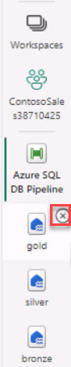

# Task 4.2: Read from Silver layer Create Data Model (Facts, Dimensions) on the data lake from Azure Databricks and write data into Gold layer as external tables. (Z-ordered within ADLS Gen2 as the Gold layer)

The last step is to develop and implement a robust data model from the Silver layer, moving critical data into the Gold layer, thus bolstering Contoso's analytics and decision-making capabilities with structured and refined data sets. 

<details>

  <summary>Click me</summary>

  | Header 1 | Header 2 |
  | -------- | -------- |
  | Row 1    | Row 1    |
  | Row 2    | Row 2    |
  
</details>

1. From the workspace, select the **Silver to Gold** notebook.

1. In the **Cmd 1** cell, populate the **ENTERHERE** placeholders with the appropriate information.

    **Cmd 1**
    | Name | Value |
    |:---------|:---------|
    | scope   | +++scopesecret+++   |
    | key   | Go to the Key Vault resource to retrieve the Secrets name   |
    | storage_account   | Go to the Storage Account resource to retrieve the Storage account name   |
    | application_id   | Go to the Microsoft Entra > App registration Overview page to retrieve    |
    | directory_id   | Go to the Microsoft Entra > App registration Overview page to retrieve   |

    {: .note }
    > In the **Cmd 1** cell, the first five lines contain the **ENTERHERE** placeholders. Expand below for assistance with this step.
    >
    > <details>
    > <summary>
    > Expand here for help populating the **Cmd 1** cell. 
    > </summary>
    >
    > Retrieve the values from the expandable solution in Task 2.
    >
    > </details> 

1. In the **Cmd 2** cell, populate the **ENTERHERE** placeholder with the appropriate information.

    {: .note }
    > In the **Cmd 2** cell, the first line contains the **ENTERHERE** placeholder. Expand below for assistance with this step.
    >
    > <details>
    > <summary>
    > Expand here for help populating the **Cmd 2** cell. 
    >
    > </summary>
    >
    > **Cmd 2**
    > | Name | Value |
    > |:---------|:---------|
    > | container_name   | +++"medallion"+++   |
    > </details>

1. In the **Cmd 6** cell, populate the **ENTERHERE** placeholder to create dimProduct using the following: 

    - Join data from two tables, `salesproduct` and `salesproductcategory`, based on the `ProductCategoryID` column.

    - Include all columns from the `salesproduct` table (`sp`) and the `ParentProductCategoryID` and `Name` columns from the `salesproductcategory` table (`spc`), with the `Name` column renamed as `ProductCategoryName`.

    - Add a surrogate key column named `ProductIDKey` to the DataFrame using the `monotonically_increasing_id()` function.

    - Ensure that the surrogate key column is the first column in the DataFrame.
    
    - Exclude the `spc.Name` column from the `salesproductcategory` table in the final DataFrame.

    {: .note }
    > In the **Cmd 6** cell, line three contains the **ENTERHERE** placeholder. Expand below for assistance with this step.
    >
    > <details>
    > <summary>
    > Expand here for help populating the **Cmd 6** cell. 
    >
    > </summary>
    >
    > **Cmd 6**
    > | Name | Value |
    > |:---------|:---------|
    > | df_dimProduct   | +++spark.sql("select sp.*, spc.ParentProductCategoryID, spc.Name as ProductCategoryName from salesproduct sp join salesproductcategory spc on sp.ProductCategoryID = spc.ProductCategoryID")+++   |
    > </details>

1. In the **Cmd 13** cell, populate the **ENTERHERE** placeholder to create factSales using the following guidance: 

    To create the df_factSales DataFrame, follow these steps:

    - Join data from two tables, `salesorderheader` and `salesorderdetail`, based on the `SalesOrderID` column.

    - Include all columns from both the `salesorderheader` and `salesorderdetail` tables.

    - Left join the `dimProduct` table (dp) on the `ProductID` column from the `salesorderdetail` table.

    - Left join the `dimCustomer` table (ds) on the `CustomerID` column from the `salesorderheader` table.

    - Select the following columns:
    
        - `ProductIDKey` from the `dimProduct` table (dp)

        - `CustomerIDKey` from the `dimCustomer` table (ds)

        - All columns from the `salesorderheader` table (soh)

        - `OrderQty`, `ProductID`, `UnitPrice`, `UnitPriceDiscount`, and `LineTotal` from the `salesorderdetail` table (sod)    

    {: .note }
    > In the **Cmd 13** cell, populate the **ENTERHERE** placeholder. Expand below for assistance with this step.
    >
    > <details>
    > <summary>
    > Expand here for help populating the **Cmd 13** cell. 
    >
    > </summary>
    >
    > **Cmd 13**
    >
    > ```spark.sql-wrap
    > "select dp.ProductIDKey, ds.CustomerIDKey, soh.*, sod.OrderQty, sod.ProductID, sod.UnitPrice, sod.UnitPriceDiscount, sod.LineTotal from salesorderheader soh join salesorderdetail sod on soh.SalesOrderID = sod.SalesOrderID LEFT JOIN dimProduct dp ON sod.ProductID = dp.ProductID LEFT JOIN dimCustomer ds ON soh.CustomerID = ds.CustomerID"
    > ```
    > </details>


1. Select **Run all**.

1. Review each cell.

1. Go to the **medallion** container and verify that the delta files are present in the **gold** directory.

1. Return to the Fabric workspace.

1. On the left navigation, close the three Lakehouses by selecting the **X**.

    
