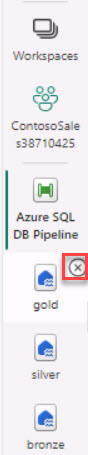

# Task 04: Verify that delta files were written to the gold medallion container 

1. Switch to the browser tab for the Azure portal.  In the search box, search for and select your **[Storage Account Name]**.

1. In the left navigation pane, select **Data Storage** and then select **Containers**.

1. Select the  **medallion** container. Verify that the delta files are present in the **gold** directory.

1. Open a new browser tab and go to **https://app.powerbi.com/**

1. In the lower left of the navigation pane, select **Power BI** and then select **Data Factory**.

1. In the left navigation, close the three Lakehouses by selecting the **X**.

    

1. Leave the page open.
