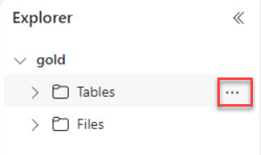
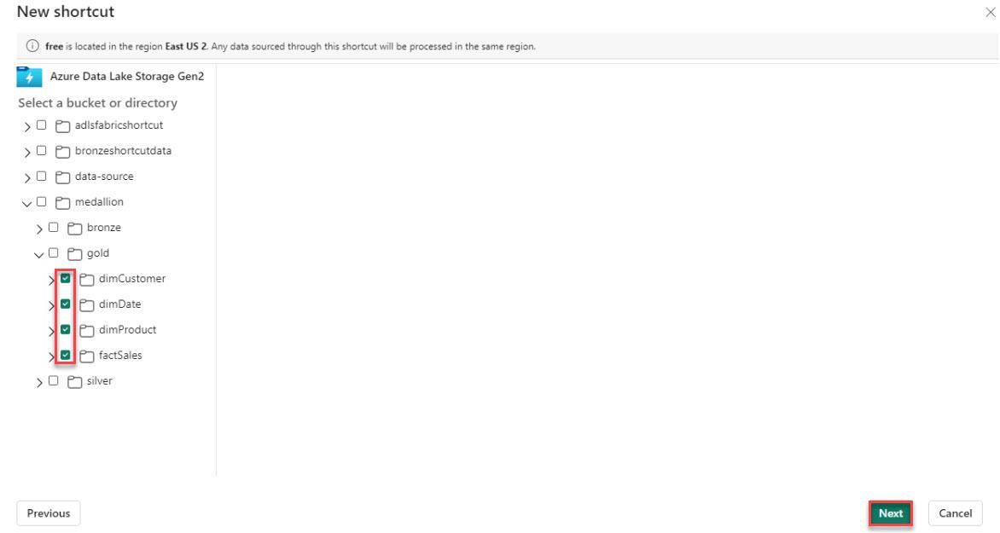
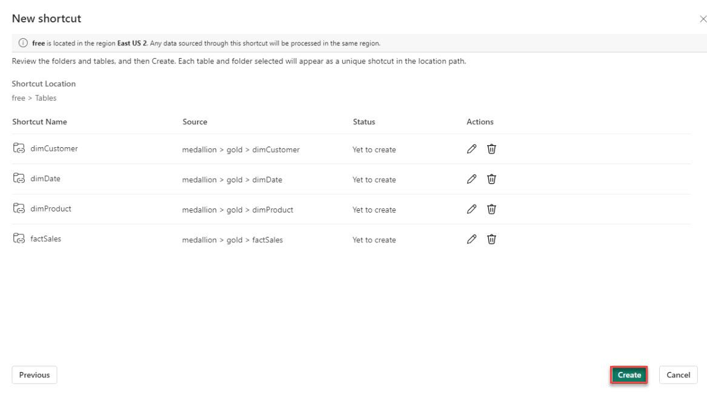

# Task 01: Create a shortcut from the Lakehouse pointing to the Gold layer

This task involves setting up a Lakehouse architecture within the Microsoft Fabric ecosystem. Then, with the Lakehouse established, the next step is to ensure that it is seamlessly integrated with the existing data layers, particularly the Gold layer in Azure Data Lake Storage (ADLS) Gen 2. 

The Gold layer houses Contoso's most refined and valuable data, ready for business intelligence and analytics. Creating a shortcut to this layer within the Lakehouse framework ensures that users and applications can access the most pertinent data without navigating through the complexities of the data storage hierarchy. 

1. In the lower left of the navigation pane, select **Data Factory**. Then, in the synapse section, select **Data Factory**.

1. Create a new Lakehouse named **gold_shortcut**.

1. On the Explorer blade, under **gold_shortcut**, select the ellipses (**...**) next to **Tables**.

    

1. Select **New shortcut**.

1. In the External sources section, select the **Azure Data Lake Storage Gen2** tile.

1. In the **New shortcut** window, select **Existing connection** and select the connection.

   >{: .note }
   >If the existing connection is not listed or if you’re no longer signed in, enter the URL for your storage account in the URL box (e.g., https://your-storage-account-name.dfs.core.windows.net/) and then select Sign in. Then, select your account name.

1. On the **Connection** menu, select the previously created connection and select **Next**.

1. In the left menu, expand **medallion** > **gold**, select the following checkboxes, and then select **Next**:

    - **dimCustomer**
    - **dimProduct**
    - **dimDate**
    - **factSales**

    

1. Select **Create**.

    

