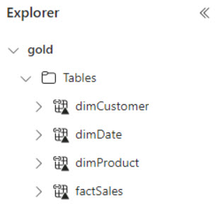

# Task 5.1: Create a shortcut from the Lakehouse pointing to the Gold layer

This task involves setting up a Lakehouse architecture within the Microsoft Fabric ecosystem. Then, with the Lakehouse established, the next step is to ensure that it is seamlessly integrated with the existing data layers, particularly the Gold layer in Azure Data Lake Storage (ADLS) Gen 2. 

The Gold layer houses Contoso's most refined and valuable data, ready for business intelligence and analytics. Creating a shortcut to this layer within the Lakehouse framework ensures that users and applications can access the most pertinent data without navigating through the complexities of the data storage hierarchy. 

1. Return to the **Fabric workspace** browser tab.

1. Create a new Lakehouse, enter +++gold_shortcut+++ for the name.

1. On the **Explorer** blade, under **gold_shortcut**, select the ellipses next to **Tables**.

    

1. Select **New shortcut**.

1. Under **External sources**, select the **Azure Data Lake Storage Gen2** tile.

1. On the Connection settings window, enter the following and select **Next**:

    | Default | Value |
    |:---------|:---------|
    | URL   | +++https://storage@lab.LabInstance.Id.dfs.core.windows.net/+++   |
    | Authentication kind   | **Organizational account**   |    

1. In the **Shortcut Name** box, enter +++dimCustomer+++.

1. In the **Sub Path** box, enter +++/medallion/gold/dimCustomer+++ and then select **Create**.

1. On the **Explorer** pane, expand the **dimCustomer** table to verify that the table is populated.

1. Repeat this process to create three more shortcuts using the following:

    | **Shortcut name** | **Sub Path** |
    |:---------|:---------|
    | +++dimProduct+++   | +++/medallion/gold/dimProduct+++   |
    | +++dimDate+++   | +++/medallion/gold/dimDate+++   |
    | +++factSales+++   | +++/medallion/gold/factSales+++   |   

    
