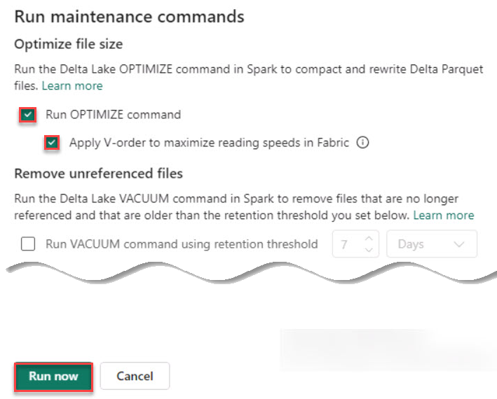

# Task 5.2: Read data using the shortcut and write it to the Lakehouse as tables

Finally, this task is about leveraging the shortcut to efficiently query and retrieve data from the Gold layer, then organizing it within the Lakehouse as structured tables. This approach enhances data discoverability and usability, allowing Contoso to implement a more sophisticated data serving layer. The tables are organized in a manner (V-order) that optimizes query performance, ensuring that analytics and reporting tools can access and analyze the data with minimal latency. 

1. On the Explorer blade, select the ellipsis (***...***) next to dimCustomer and then select **Maintenance**.

1. In the Run maintenance commands window, verify that **Run OPTIMIZE command** and **Apply V-order to maximize reading speeds in Fabric** are selected and select **Run now**.

    

    >{: .important }
    >There’s no requirement to wait for the commands to complete before beginning the next step. Start all four at the same time.

1. Repeat the previous steps to run maintenance commands for the **dimDate**, **dimProduct**, and **factSales** tables.

    >{: .warning }
    >Wait for the table optimizations to complete.

    
