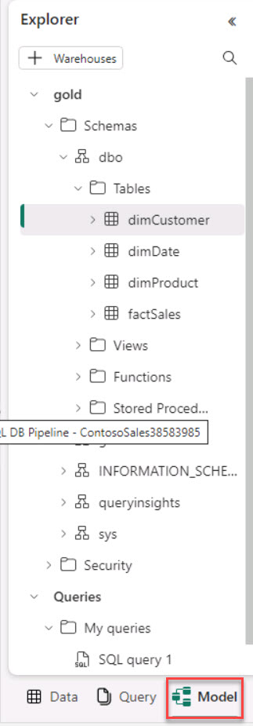
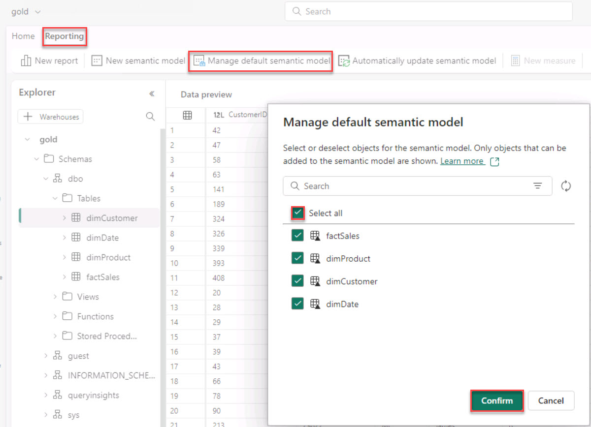

# Task 6.1: Create a new semantic model and choose required tables

Begin by crafting a new semantic model in Power BI, selecting the necessary tables from the data Lakehouse. This model serves as the foundation for all further analysis, encapsulating the logic and structure needed to explore Contoso's data effectively.

1. On the upper right, next to the **Share** option, select the menu and select **SQL analytics endpoint**.

    

1. On the lower left, select **Model** to change the view.

    

1. On the upper left, select **Reporting** > **Manage default semantic model**, select **Select all**, then select **Confirm**. 

    

   {: .warning }
   > Wait for the semantic model to complete.
