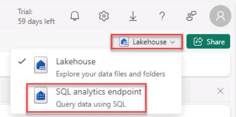
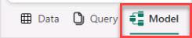
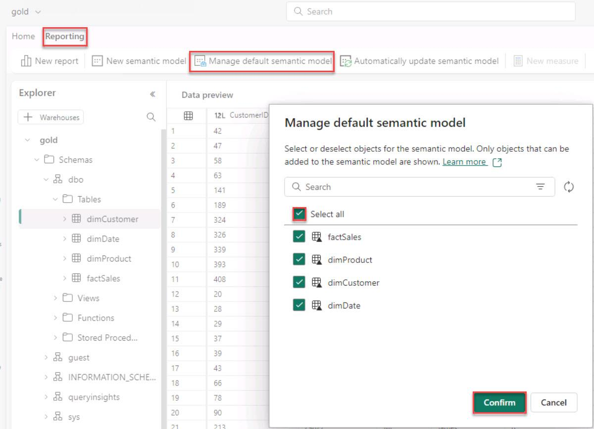

# Task 01: Create a new semantic model and choose required tables

Begin by crafting a new semantic model in Power BI, selecting the necessary tables from the data Lakehouse. This model serves as the foundation for all further analysis, encapsulating the logic and structure needed to explore Contoso's data effectively.

1. In the upper-right, next to **Share**, select the menu and select **SQL analytics endpoint**.

    

1. In the lower-left, select **Model** to change the view.

    

1. In the upper-left, select **Reporting** and then select **Manage default semantic model**.

1. In the **Manage default semantic model** dialog box, select **Select all** and then select **Confirm**. 

    

   >{: .warning }
   > Wait for the semantic model to complete.
