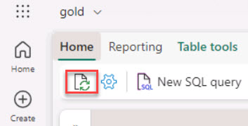
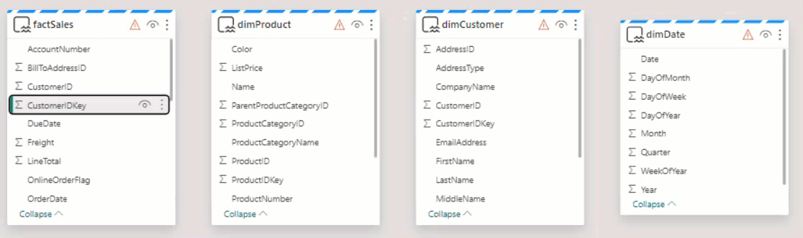

# Task 02: Create relationships

Establish relationships between the tables within the semantic model. This step is crucial for creating a coherent data model that accurately reflects the intricacies of Contoso's operations, ensuring that the reports generated provide meaningful insights. 

1. In the upper left, select **Home**.

1. Under the **Home** tab, on the menu, select the **Refresh** icon.

    

    >{: .warning }
    > This refresh is required for the workspace to show the proper objects.

    >{: .note }
    > There should be four tables in the view. Use the Scale sliders to adjust the view as necessary.

1. Drag **factSales** > **CustomerIDKey** to **dimCustomer** > **CustomerIDKey** to create the relationship between the two tables.

    

1. In the **New relationship** window, select the **Assume referential integrity** checkbox and then select **Save**. 

1. Drag **factSales** > **ProductIDKey** to **dimProduct** > **ProductIDKey**

1. In the **New relationship** window, select **Assume referential integrity** and then select **Save**.

1. Drag **factSales** > **OrderDate** to **dimDate** > **Date**.

    >{: .warning }
    > On the following **New relationship window**, **DO NOT** select the **Assume referential integrity.** option.
    
    > 

1. On the **New relationship** window, keep the default settings and select **Save**.
