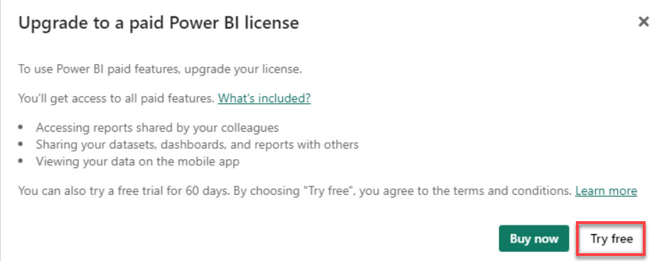
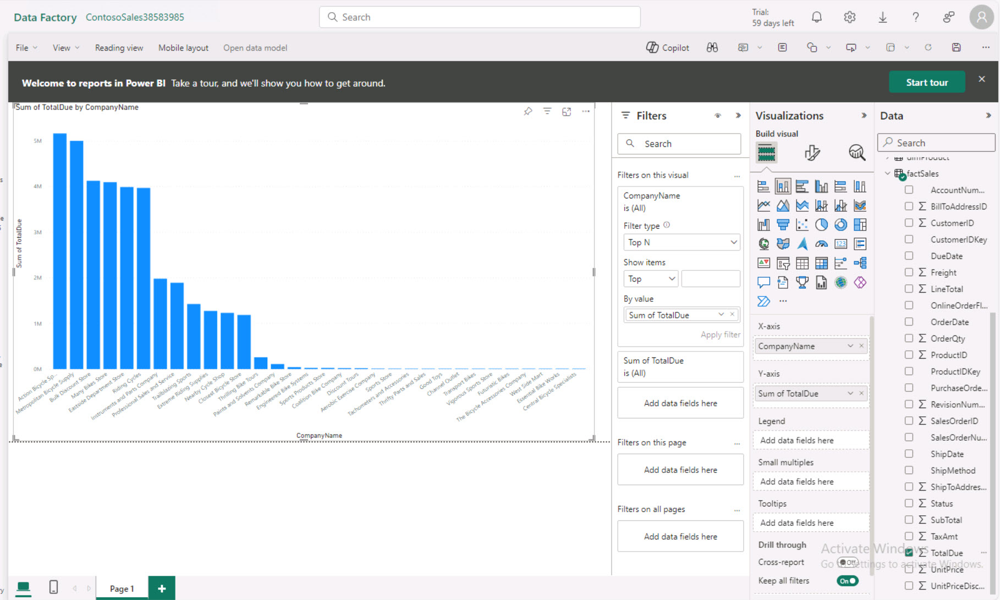

# Task 6.3: Create a PowerBI report point to the semantic model (using direct lake mode)

With the model and relationships set up, create a Power BI report that points directly to the semantic model, utilizing Direct Query mode to access the data lake. This approach allows Contoso to generate real-time insights from their data, supporting dynamic decision-making processes and fostering a culture of informed strategy development across the organization. 

1. On the menu above the canvas, select **New report**.

1. Once the **Upgrade to Power BI Pro License** message appears, select **Try free**.

    

1. On the All paid features of Power BI are yours for 60 days window, select **Got it**.

    

1. From the **Visualizations** blade, select the **Stacked column chart**.

1. From the **Data** blade, select **dimCustomer** > **CompanyName**.

1. From the **Data** blade, select **factSales** > **TotalDue**.

1. From the **Filters** blade, select the **CompanyName is (All)** filter card.

1. From the **Filter type** menu, select **Top N**.

1. In the **Show items** box, enter +++10+++.

1. From the **Data** blade, select **factSales** > **TotalDue** and drag it to the **By value** box on the filter card.

    

1. From the **Visualizations** blade, under **Build visual**, select **Format your Visual** > **General** > **Title**.

1. In the **Text** box enter +++Top 10 Customers+++ and then select **Apply filter**.

1. If necessary, drag the chart to expand its size.

    {: .note }
    > These are the top 10 companies.
 
1. Try adding to this report on your own. 

    {: .note }
    > Add a report for the top 10 companies based on sales revenue and the top five products sold by each company.
