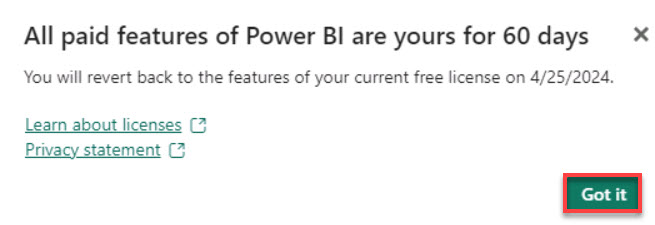

# Task 03: Create a PowerBI report point to the semantic model (using direct lake mode)

With the model and relationships set up, create a Power BI report that points directly to the semantic model, utilizing Direct Query mode to access the data lake. This approach allows Contoso to generate real-time insights from their data, supporting dynamic decision-making processes and fostering a culture of informed strategy development across the organization. 

1. On the menu above the canvas, select **New report**.

1. Once the **Upgrade to Power BI Pro License** message appears, select **Try free**.

    

1. In the **All paid features of Power BI are yours for 60 days** dialog box, select **Got it**.

    

1. On the **Visualizations** pane, select the **Stacked column chart**.

    .

   >{: .note }
   >You can drag the chart to expand its size or select **Focus mode** to make the visualization fill the pane.

   

1. On the **Data** pane, select the **dimCustomer** > **CompanyName** checkbox.

1. On the **Data** pane, select the **factSales** > **TotalDue** checkbox.

1. On the **Filters** pane, select the **CompanyName is (All)** filter card.

1. Select the **Filter type** menu and then select **Top N**.

1. In the **Show items** box, enter **10**.

1. On the **Data** pane, select **factSales** > **TotalDue** and drag it to the **By value** box on the filter card.

    

1. On the **Visualizations** pane, under **Build visual**, select **Format your Visual**.

1. Select the **General** tab and then expand **Title**.

1. In the **Text** box enter **Top 10 Customers**.

    >{: .note }
    > These are the top 10 companies.
 
1. Try adding to this report on your own. 

    >{: .note }
    > Add a report for the top 10 companies based on sales revenue and the top five products sold by each company.
