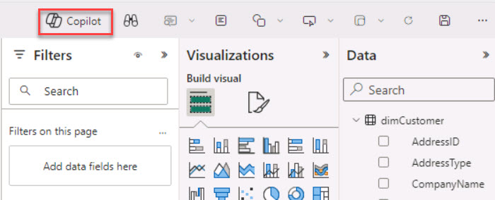
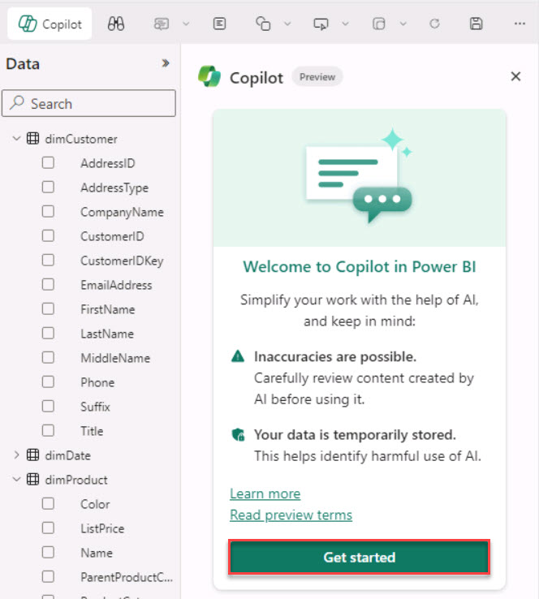
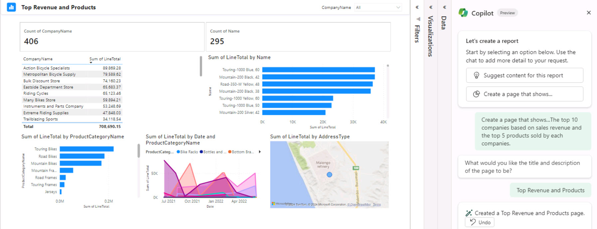

# Task 01: Interact with Copilot

For starters, challenge Copilot to create the same top 10 companies based on sales revenue report and the top five products sold by each company report discussed in the previous Exercise.

1. On the menu above the **Filters**, **Visualizations**, and **Data** panes, select **Copilot**.

    

1. On the **Copilot** pane, select **Get started**.

    

1. Select **Create a new report page** and then, in the prompt, enter the following:

    ```Copilot-wrap
     that shows the top 10 companies based on sales revenue and the top 5 products sold by each company.
    ```
1. Select **Send**.
   
1. When prompted for the title and description of the page, enter the following and then select **Send**:

    ```Copilot
    Top Revenue and Products
    ```

1. Review the page that Copilot produced. See below for an example page.

    

1. On your own, modify one of the visuals in the page and review the changes. 
