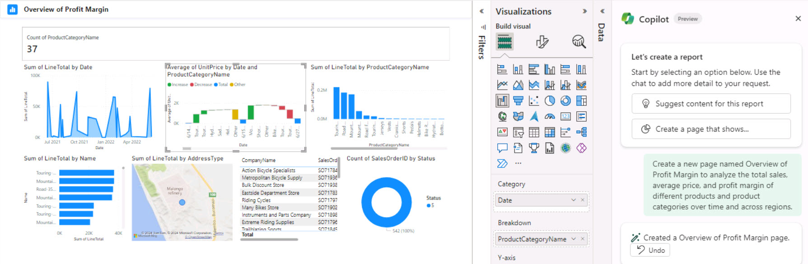
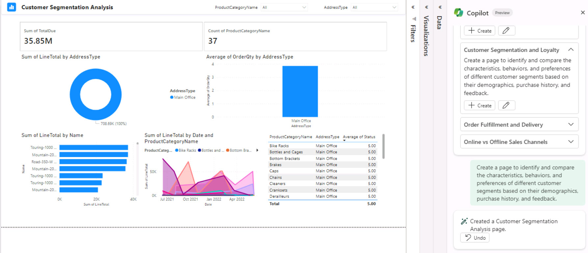

# Task 02: Create a page about Profit Margin

1. Close the Copilot pane and re-open it to start over.

1. In the prompt, enter the following and then select **Send**:


    ```Copilot-wrap
    Create a new page named Overview of Profit Margin to analyze the total sales, average price, and profit margin of different products and product categories over time and across regions.
    ```

1. Review the results.

     

1. Use Copilot to suggest content for this report. On the **Copilot** pane, under **Here are some things you can try**, select **Suggest content for this report**.

1. On your own, follow the prompts and choose one of the suggestions provided by Copilot, then select the pencil to enter the text into the prompt.

    

**Congratulations! You have completed the Microsoft Fabric and Azure Databricks lab!**
