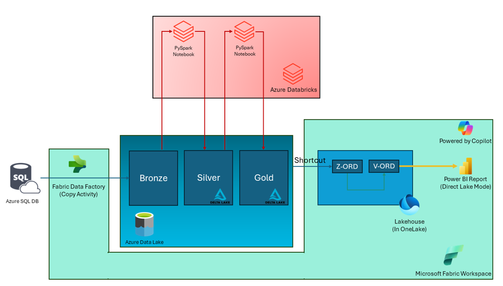

# TechExcel: Microsoft Fabric with Azure Databricks for Data Analytics (lvl 300 / CSU) lab

**The estimated time to complete this lab is six hours.**

## Overview

This lab showcases Microsoft Fabric and Azure Databricks, featuring a performance-optimized and cloud-native analytics solution pattern. This architecture unifies a customer’s data estate to accelerate data value creation.  

The visual illustrates the real-world example for Contoso, a fictitious company. Contoso is a retailer with thousands of brick-and-mortar stores across the world. They also have an online store. Contoso is acquiring Litware Inc. Litware has curated marketing data and sales data processed by Azure Databricks and stored in the gold layer in ADLS Gen 2. 
During our exercises, we’ll see how they leveraged the power of Microsoft Fabric to ingest data from disparate sources, combine data with their existing data from ADLS Gen2, and derive meaningful insights. You’ll witness how the team used a shortcut to reference the existing Litware data from ADLS Gen2. You’ll also see how they mounted the OneLake endpoint in Azure Databricks to derive meaningful insights using compute in Azure Databricks.  
 
The lab scenario starts on January 30th. The company's new CEO, April, recently noticed negative trends in their KPIs, including:

* High customer churn
* Declining sales revenue
* High bounce rate on their website
* High operating expenses
* Poor customer experience

April asks Rupesh, the Chief Data Officer how they could create a data-driven organization and reverse these adverse KPI trends. Rupesh talks to his technical team, including Eva, the data engineer, Miguel, the data scientist, and Wendy, the business analyst, to design and implement a solution pattern to realize this dream of a data-driven organization. Our story is centered around Rupesh and his team. They recognize that the existence of data silos within Contoso's various departments presents a significant integration challenge. 

During this lab, as a part of this team, you’ll execute some of these steps to reverse these adverse KPI trends.

Here are the Microsoft Fabric workloads showcased in this solution along with Azure Databricks.

- Synapse Data Engineering
- Data Factory
- Synapse Data Science
- Synapse Data Warehouse
- Power BI
- Synapse Real-time Analytics

## Prerequisite files

[Download the Bronze to Silver and Silver to Gold notebooks](https://github.com/microsoft/TechExcel-Fabric-with-Databricks-for-Data-Analytics/blob/main/docs/resources/Notebooks.zip) to your local machine. You will need to import them into your Azure Databricks environment during the lab.

## Exercises

This lab has exercises on:

- Setting up the environment
- Creating a Fabric workspace and data pipeline
- Establishing connectivity between Azure Databricks and Azure Data Lake Storage (ADLS) Gen 2
- Implementing the Medallion Architecture using Azure Databricks (Bronze, Silver and Gold layers)
- Serving data with Microsoft Fabric
- Creating PBI reports
- Use PowerBI Copilot

## Disclaimer

This presentation, demonstration, and demonstration model are for informational purposes only and (1) are not subject to SOC 1 and SOC 2 compliance audits, and (2) are not designed, intended, or made available as a medical device(s) or as a substitute for professional medical advice, diagnosis, treatment, or judgment. Microsoft makes no warranties, express or implied, in this presentation, demonstration, and demonstration model. Nothing in this presentation, demonstration, or demonstration model modifies any of the terms and conditions of Microsoft’s written and signed agreements. This is not an offer, and applicable terms and the information provided are subject to revision and may be changed at any time by Microsoft.

This presentation, demonstration, and demonstration model do not give you or your organization any license to any patents, trademarks, copyrights, or other intellectual property covering the subject matter in this presentation, demonstration, and demonstration model.

The information contained in this presentation, demonstration, and demonstration model represents the current view of Microsoft on the issues discussed as of the date of presentation and/or demonstration, for the duration of your access to the demonstration model. Because Microsoft must respond to changing market conditions, it should not be interpreted to be a commitment on the part of Microsoft, and Microsoft cannot guarantee the accuracy of any information presented after the date of presentation and/or demonstration and for the duration of your access to the demonstration model.

No Microsoft technology, nor any of its component technologies, including the demonstration model, is intended or made available as a substitute for the professional advice, opinion, or judgment of (1) a certified financial services professional, or (2) a certified medical professional. Partners or customers are responsible for ensuring the regulatory compliance of any solution they build using Microsoft technologies.

## Copyright

© 2023 Microsoft Corporation. All rights reserved. 

By using this demo/lab, you agree to the following terms:

The technology/functionality described in this demo/lab is provided by Microsoft Corporation for purposes of obtaining your feedback and to provide you with a learning experience. You may only use the demo/lab to evaluate such technology features and functionality and provide feedback to Microsoft. You may not use it for any other purpose. You may not modify, copy, distribute, transmit, display, perform, reproduce, publish, license, create derivative works from, transfer, or sell this demo/lab or any portion thereof.

COPYING OR REPRODUCTION OF THE DEMO/LAB (OR ANY PORTION OF IT) TO ANY OTHER SERVER OR LOCATION FOR FURTHER REPRODUCTION OR REDISTRIBUTION IS EXPRESSLY PROHIBITED.

THIS DEMO/LAB PROVIDES CERTAIN SOFTWARE TECHNOLOGY/PRODUCT FEATURES AND FUNCTIONALITY, INCLUDING POTENTIAL NEW FEATURES AND CONCEPTS, IN A SIMULATED ENVIRONMENT WITHOUT COMPLEX SET-UP OR INSTALLATION FOR THE PURPOSE DESCRIBED ABOVE. THE TECHNOLOGY/CONCEPTS REPRESENTED IN THIS DEMO/LAB MAY NOT REPRESENT FULL FEATURE FUNCTIONALITY AND MAY NOT WORK THE WAY A FINAL VERSION MAY WORK. WE ALSO MAY NOT RELEASE A FINAL VERSION OF SUCH FEATURES OR CONCEPTS. YOUR EXPERIENCE WITH USING SUCH FEATURES AND FUNCITONALITY IN A PHYSICAL ENVIRONMENT MAY ALSO BE DIFFERENT.

